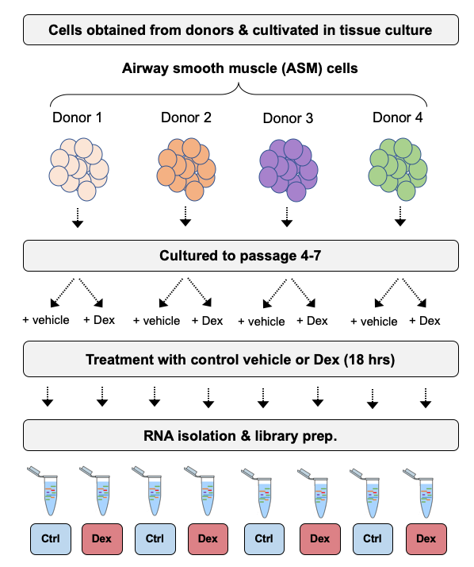
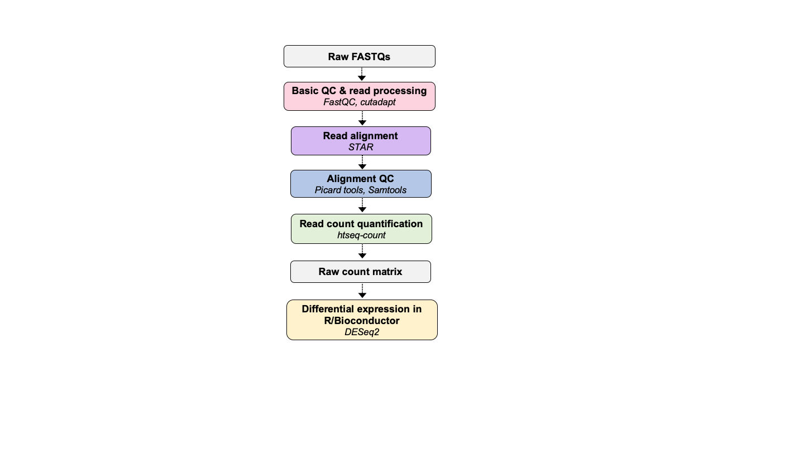

# Part 0 - Dataset & setup

### Learning objectives: 
- Familize yourself with the data set, directories, and set up your own
- Understand the importance of good data management for RNA-seq analysis

Lets login to discovery7 and start and interactive session before we get started.  
```bash
# open a secure connection.
ssh d41294d@discovery7.dartmouth.edu

# start the interactive session
mksub -I -l nodes=1:ppn=4 -l walltime=20:00:00
```

## Dataset for the workshop 

We will be using the RNA-seq dataset described in [Himes *et al*, 2014, *PloS One*](https://journals.plos.org/plosone/article?id=10.1371/journal.pone.0099625). This study investigates the mechanism by which glucocorticoids, a major treatment used in asthma care, prevent inflammation of airway smooth muscle cells (ASM). The authors sequenced 4 primary human ASM cell lines that were treated with dexamethasone (Dex), albuterol (Alb), or both dexamethasone and albuterol (co-tx) for 18 hours before sample collection (although only Dex samples are considered in the paper). They then use differential expression analysis to identify >300 differentially expressed genes (DEGs). 

This is the same dataset used in some of the [tutorial materials](http://bioconductor.org/packages/devel/bioc/vignettes/DESeq2/inst/doc/DESeq2.html) for *DESeq2* (which we will be using for differential expression analysis in R/Bioconductor on day 2). 



## Raw data 

Raw sequence data was obtained from the [*Sequence Read Archive*](https://www.ncbi.nlm.nih.gov/sra)
[SRA toolkit](https://github.com/ncbi/sra-tools) (SRA) under project accession [SRP033351](https://www.ncbi.nlm.nih.gov/sra?term=SRP033351). The raw FASTQ files are locted in `/dartfs-hpc/scratch/rnaseq1/`. Each sample is named according to their **SRR** identifier from the SRA. SRR (SRA run accession) identifiers are used to denote objects containing actual sequencing data from a sequencing run. 

If you would like to learn more about how to obtain publicly available data from the SRA, you should consult the [NCBI download guide](https://www.ncbi.nlm.nih.gov/books/NBK242621/). We also plan to include this topic in future workshops.  

Summary level count data (FPKM) is also available from the Gene Expression Omnibus (GEO) under accession [GSE52778](https://www.ncbi.nlm.nih.gov/geo/query/acc.cgi?acc=GSE52778), although we won't use it for this project. If raw counts were available, and you wished to analyze this data for your own project, obtaining the raw counts from GEO could save a great deal of time pre-processing data (although you have to trust they did most of it right). 

```bash
# lets have a look at the project directory containing the raw FASTQs
ls -lah /dartfs-hpc/scratch/rnaseq2/data/raw-fastq/
```

Since these are paired-end reads (we will talk more about this) each sample has 1 file for read 1 (SRRXXX_1) and 1 file for read 2 (SRRXXX_2). All of the files are `gzipped` in order to reduce the disk space they require, which is important as you can see that they are all generally at least **1GB** (you need a lot of space to process RNA-seq, or other-NGS data). 

## Metadata 

In addition to the raw sequence data in FASTQ format, we also need to know information about how the data was generated and characteristics of the individual samples. These information are usually referred to as the **metadata**, and include variables ranging from *library preparation protocol* and the *sequencing configuration* used, to the *treatment group* and *replicate ID*. Without the associated metadata, we wouldn't know how to process the data appropriately, how to make key quality assessments, or set up the differential expression analysis. 

### Some key metadata for these data (from the paper and SRA entry): 
- ***Primary ASM cells*** were isolated from lung transplant donors with no chronic illness  
- ***Passages 4 to 7*** ASM cells maintained in ***Ham's F12 medium*** supplemented with 10% FBS  
- For treatment with Dex, cells were treated with ***1uM Dex*** or ***control vehicle*** for 18 hours (4 replicates in each group). 
- RNA was harvested and prepared into cDNA libraries using the ***Illumina TruSeq RNA Sample Prep Kit v2***
- Libraries were sequenced using 75-bp paired-end reads on an ***Illumina Hiseq-2000***

You can find two *.csv* files (`SraRunInfo.csv` and `sra_result.csv`) in the GitHub project directory `Day-2/` that contain detailed metadata obtained from the SRA. We will use these files on Day-2 when performing the differential expression analysis. 

## Analysis overview

During day 1, we will pre-process the raw sequence data, assess its quality, and reduce it to a matrix of raw read counts. Over day 2, we will perform a detailed exploratory analysis of the data, before conducting a robust differential expression analysis using *DESeq2*. 



As we move through day 1, we will be generating a lot of intermediate files for each of these steps. You will all create your own directory in `/dartfs-hpc/scratch/` where you will run your analyses and store you results. Go ahead and initalize a directory for yourself now. 

```bash
# navigate to scratch 
cd /dartfs-hpc/scratch/

# make the directory 
mkdir omw

# go into it
cd omw
``` 

We need to set up some sub-directories where we will conduct each step. The desired directory strcuture for the workshop looks like this: 
```bash
rnaseq1
  ├── raw_data
  ├── results
  └── scripts
```

Lets make the subdirectories: 
```bash
mkdir raw_data results scripts 
``` 

We will use Symbolic links (sym links) to link the raw data in `/dartfs-hpc/scratch/rnaseq1/data/raw-fastq` to the directory we created for ourselves in scratch. Sym links provide a way of linking to distant files from within a directory that they do not actually exist inside. Since most genomics data is very large, it is impractical to move it around and copy it, so we use Sym links to point to files as if they were in our current directroy. 

Look in `/dartfs-hpc/scratch/rnaseq1/data/raw-fastq`
```bash 
ls -lah /dartfs-hpc/scratch/rnaseq1/data/raw-fastq
```

You can see that the raw data for all samples is there, although, as we mentioned, it is very large, and each step in processing individual files can take a long time, so we will only use a subset of these data during the pre-processing of the data on day 1. Specifically, we will be using eight FASTQs from four samples (2 controls, 2 Dex) that only contain reads aligning to chromosome 20. These files are loicated in `/dartfs-hpc/scratch/rnaseq1/data/raw-fastq/subset` and are much smaller and we will be able to complete time consuming steps like read alignment to the reference genome, in a practical time period. 

Set up sym links to the raw FASTQs: 
```bash 
# have a look for the files 
ls -lah /dartfs-hpc/scratch/rnaseq1/data/raw-fastq/subset/

# set up the sym link 
ln -s /dartfs-hpc/scratch/rnaseq1/data/raw-fastq/subset/*fastq.gz ./

# have a lok at the links in your directory 
ls -lah 
``` 

For each step of the analysis in day 1, you can see we have included all of the files generated at each step for each sample in `/dartfs-hpc/scratch/rnaseq1/data/`. While we will only use some of this data during day 1 of the workshop, we've made the entire processed dataset available if you want to practice with it, or try to replicate it yourself. We will leave this on `scratch` for about 1 month before removing it. 

You should have also created a `conda` environment called `rnaseq1` by following the guidance in the workshop setup. `conda` is an excellent way to manage software versions, especially on high performance computing systems. It is critical you **know AND track** which version of software you use for an analysis. Not only do you need to report this when you move to publish your work, but is also important for anyone trying to reproduce your work. 

Activate the conda environment:
```bash
conda activate rnaseq1
```
If you don't know what is rnaseq1, please visit [here](https://github.com/Dartmouth-Data-Analytics-Core/RNA-seq_workshop_July2020/blob/master/welcome-%26-setup.md).

We are now ready to start working with the data and processing the raw FASTQ files. 
