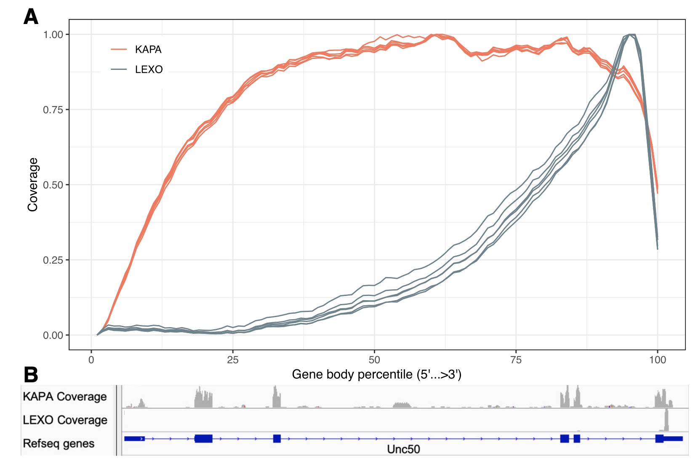
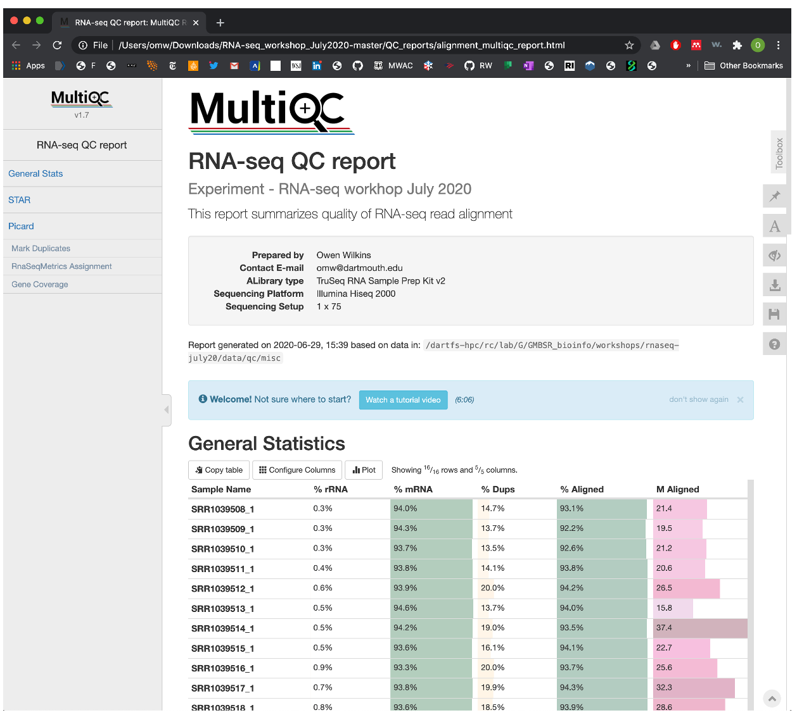

# Part 3 - Post-alignment QC

### Learning objectives: 
- Gain understanding of the key QC metrics used to evaluate quality of RNA-seq alignments
- Learn what values represent acceptable quality alignments 
- Learn how to calculate RNA-seq QC metrics & synthesize them into a report 

Lets make a new directory to work in: 
```bash
# go to our home dir for the workshop 
rnaw

# make a new dir for qc
mkdir results/alignment.qc
cd results/alignment.qc
```

## Principles of post-alignment QC
Once you have aligned your reads, it is important to assess how well our reads could be mapped to the reference genome. The primary metric of a successful alignment is the **percentage of uniquely mapped reads**, and while this depends on the organism and reference genome you map to, a good quality sample is expected to have ~75% of its reads uniquely mapped. As we did earlier, we can find this information, as well as the number of unmapped and multi-mapping reads, in the `final.out` file generated by STAR. 

```bash
cat ../alignment/SRR1039508.Log.final.out
```  

However, there are several other valuable QC metrics that evaluate features of genome alignments and allow us to identify potential issues or biases that may exist in the data. These metrics include: 

- **Genomic context of reads**: We expect the majority of our reads to map in coding/UTR regions, with few reads in intronic or intergenic regions. If the proportion of intronic or intergenic reads is high, this could suggest your library is contaminated with genomic DNA, or the annotation provided for the reference genome is incomplete. 

- **Proportion of ribosomal RNA (rRNA) reads**: rRNA constituties the large majority of RNA present in most cell types, which are usually not of interest in our experiment, therefore we try to reduce their numbers using depletion and polyA slection procedures in library preparation. These procedures are not always 100% effective. If the proportion of rRNA reads is high, you should filter these reads before differential expression analysis, as it may skew the normalization of your count matrix. 

- **Gene body coverage**: Depending on the type of library protocol used, you will have an expectation for the average distribution of reads over gene bodies. For full-length transcript methods, you expect coverage over the entire body of a gene, however for 3'-end methods (e.g. QuantSeq) you expect a heavy 3' bias. Any significant deviations from expected can indicate sample quality problems that may be reflective of issues in library preparation. 

<p align="center">

</p>	

Image from: Ma *et al*, 2019, *BMC Genomics*. 

- **Strand specificity**: For stranded library-preparation protocols, we expect almost all the reads to come from the expected strand (e.g. *REV* for KAPA libraries, *FWD* for QuantSeq 3' libraries. For non-stranded protocols, the distribution of reads should be equally split between *FWD* and *REV*. 

[Picard tools](https://broadinstitute.github.io/picard/) (Star-trek) provides a useful tool, called [*CollectRNASeqMetrics*](https://gatk.broadinstitute.org/hc/en-us/articles/360037057492-CollectRnaSeqMetrics-Picard-) that calculates these metrics, taking the alignment SAM/BAM file as input, and returning a text file with the suffix `.output.RNA_Metrics`. 

To run CollectRNASeqMetrics on this dataset, we would run:
```bash 
picard CollectRnaSeqMetrics \
  I=../alignment/SRR1039508.Aligned.sortedByCoord.out.bam \
  O=SRR1039508.output.RNA_Metrics \
  REF_FLAT=/dartfs-hpc/scratch/rnaseq1/refs/Homo_sapiens.GRCh38.97.chr20.refFlat.txt \
  STRAND=NONE \
  RIBOSOMAL_INTERVALS=/dartfs-hpc/scratch/rnaseq1/refs/Homo_sapiens.GRCh38.97.rRNA.chr20.interval_list
```
**Option descriptions:**  
`I`=input aligned bam file  
`O`=output RNAseq metrics  
`REF_FLAT`=Gene annotations in refFlat form. Format described [here](http://genome.ucsc.edu/goldenPath/gbdDescriptionsOld.html#RefFlat)
`STRAND`= For strand-specific library prep. (e.g. use `FIRST_READ_TRANSCRIPTION_STRAND` if the reads are expected to be on the transcription strand, as in the 3'-end QuantSeq assay). 
`RIBOSOMAL_INTERVALS`= Location of rRNA sequences in genome, in interval_list format. If not specified no bases will be identified as being ribosomal. Format described [here](http://samtools.github.io/htsjdk/javadoc/htsjdk/htsjdk/samtools/util/IntervalList.html). 

```bash
cat SRR1039508.output.RNA_Metrics 
```  

### Duplicates in RNA-seq 

Another feature of RNA-seq data quality that can be evaluated after alignment is the presence of duplicate reads. Library preparation for RNA-seq generally involves PCR amplification of the input material to generate enough cDNA for sequencing. This PCR amplification can introduce bias into RNA-seq libraries as it is known that not all fragments are amplified as efficiently as others. Amplification bias is affected by features such as GC content and fragment length. Furthermore, on certain Illumina sequencers, an independent type of duplicate can occur, called *optical duplicates*, where large clusters formed on the flowcell during sequencing are called as two separate clusters. 

While removal of true duplicate reads would be the ideal solution toward correcting for this type of bias, their identification is complicated by the fact that we expect read duplicates to occur in RNA-seq data through independent sampling of RNA fragments. In particular, for genes that are expressed at high levels, it is likely reads with the same start- and end-positions will occur, even though these reads originate from separate RNA fragments and therefore should be counted independently during quantification of expression. Therefore, identfication of true duplicate reads from those originating from independent sampling is not possible in most RNA-seq data, and cannot be done effectively for single-end datasets. 

#### Duplicate removal 

Generally, most people **do not** remove duplicates from their RNA-seq data, as several studies have shown that their presence does not substantially bias differential expression analysis or dramatically reduce statistical power, [provided the library is sufficiently complex](https://www.nature.com/articles/srep25533). Furthermore, de-duplication could introduce its own form of bias as read duplicates from separate RNA fragments will be incorrectly merged. 

Despite these considerations, there is still value in checking the levels of read duplication among your aligned reads, to ensure extreme levels of duplication do not exist. We can do this with the [**MarkDuplicates**](https://gatk.broadinstitute.org/hc/en-us/articles/360036834611-MarkDuplicates-Picard-) from *Picard Tools*. *MarkDuplicates* works by comparing the coordinates, orientation, and sequence of read pairs in an input SAM/BAM file. Completion of *MarkDuplicates* will generate a text file with the suffix `xxx.markduplicates_metrics.txt` that documents key duplication statistics that can be included in our QC report.  

To run *MarkDuplicates*, we call the jar file for *Picard tools* and specify the input SAM/BAM file. 
```bash 
picard MarkDuplicates \
  I=../alignment/SRR1039508.Aligned.sortedByCoord.out.bam \
  O=SRR1039508.Aligned.out.sorted.dups.marked.bam \
  M=SRR1039508.dups.out \
  OPTICAL_DUPLICATE_PIXEL_DISTANCE=100 \
  CREATE_INDEX=false
```

**Option descriptions**:  
`I`=input aligned bam file  
`O`=output with duplicate reads marked  
`M`=file to write duplication metrics to  
`OPTICAL_DUPLICATE_PIXEL_DISTANCE`= The maximum offset between two duplicate clusters in order to consider them optical duplicates  
`CREATE_INDEX`=(TRUE/FALSE) Whether to create a BAM index when writing a coordinate-sorted BAM file. 

We then just need to make sure the `xxx.markduplicates_metrics.txt` file is included a subdirectory when we run `MultiQC`, and it will be included in the report. Lets also just have a quick look at it now. 

```bash
cat SRR1039508.dups.out
```

**Additional note:** If you have very low levels of starting material that will require a lot of PCR amplification, if you plan to sequence **very** deeply, or if removal of true duplicate reads is of particular importance to your experiment, you should consider using a library preparation method that leverages unique molecular identifiers (UMIs), which allow true read duplicates to be effectively identified and removed.  

## Run `CollectRNASeqMetrics` and `MarkDuplicates` on all samples

```bash
ls ../alignment/*.Aligned.sortedByCoord.out.bam | while read x; do

  # save the file name
  sample=`echo "$x"`
  # get everything in file name before "/" (to remove '../alignment/')
  sample=`echo "$sample" | cut -d"/" -f3`
  # get everything in file name before "_" e.g. "SRR1039508"
  sample=`echo "$sample" | cut -d"." -f1`
  echo processing "$sample"

  # run CollectRnaSeqMetrics
  picard CollectRnaSeqMetrics \
    I=../alignment/${sample}.Aligned.sortedByCoord.out.bam \
    O=${sample}.output.RNA_Metrics \
    REF_FLAT=/dartfs-hpc/scratch/rnaseq1/refs/Homo_sapiens.GRCh38.97.chr20.refFlat.txt \
    STRAND=NONE \
    RIBOSOMAL_INTERVALS=/dartfs-hpc/scratch/rnaseq1/refs/Homo_sapiens.GRCh38.97.rRNA.chr20.interval_list

  # run MarkDuplicates
   picard MarkDuplicates \
    I=../alignment/${sample}.Aligned.sortedByCoord.out.bam \
    O=${sample}.Aligned.sortedByCoord.dups.marked.bam \
    M=${sample}.dups.out \
    OPTICAL_DUPLICATE_PIXEL_DISTANCE=100 \
    CREATE_INDEX=false ;
done
```

This will take a few minutes.. read what is being printed to the screen to get an idea for what `Picard` is doing. 

## Make the QC report with MultiQC

Viewing each of the outputs from the aligner, `CollectRNASeqMetrics`, `MarkDuplicates`, etc. would obvbiously be very tedious, so we need some way of aggregating all of these data into one place so that we can compare across the whole dataset. Like we did earlier, we can use `MultiQC` to synthesize a QC report, as it recognizes output from `CollectRNASeqMetrics` and `MarkDuplicates`. 

```bash
# move STAR final.out files over to /alignment.qc
mv ../alignment/*.final.out ./

# run multiqc on /alignment.qc/
multiqc . --filename "multiqc.alignment.qc"
```

Now go to your local machine and use secure copy (scp) to download the rpeort 
```bash
scp d41294d@discovery7.dartmouth.edu:/dartfs-hpc/scratch/omw/results/alignment.qc/multiqc* .
```

Open this report and have a look at it, but also open the report for post-alignment QC in the github repo you download, located in `RNA-seq_workshop_July2020/QC-reports/`. The report we generated is only for samples mapped to chr20, so the QC metrics will look a little spotty and are less representative of what you would see in a standard experiment. The QC report in the github repo has been generated using **all samples with reads mapping to all chromosomes**. We will have a look through this together now. 

### You report should look like this:



### How does the quality look? 
### Do you think there is cause for concern for any samples?

**General notes:**
- Overall, the quality of these samples looks great. Most samples have at least 20 million aligned reads, with > 90% of the inital read successfully aligned in all samples. 
- Additionally, >90% of reads map to mRNA features, confirming that our annotation is likely of good quality, and we don't have much contamination from genomic DNA, PCR artifacts, or other species. In the `RnaSeqMetrics` section, you can hover over individual samples and see the proportion of reads mapping to intronic or intergenic sequences is very small. 
- ~75% of our aligned reads are unique (not duplicates), which is perfectly acceptable in an RNA-seq experiment 
- Coverage is well normalized over the length of the average gene, indicating we do not have any significant 3'-bias in these data 
- The only possible issue I would note is that one sample seems to have slightly fewer tital aligned reads than the others, with ~15 million. This isn't necessairily a problem, and is likely related to the amount of input material and/or its quality, and if I have done a good job of tracking sample metadata, such as the the RNA QC scores, I could test this hypothesis. I might also be careful not to make any inferences from this sample that would need to be based off deeper sequencing (e.g. identifying a novel splice junction). 

**Note:** Since we set the `STRAND` option in `CollectRNASeqMetrics` to `NONE` (as this is an unstranded dataset) there is not section in the report for strand specificity. If you library is stranded, and you told `CollectRNASeqMetrics` the correct strand that you expect your reads to be on, you should see that >99% of your reads are on the expected strand. If they are not, you either specified the wrong strand, or there was a problem in library prep. and your strand-synthesis was not very effective.
