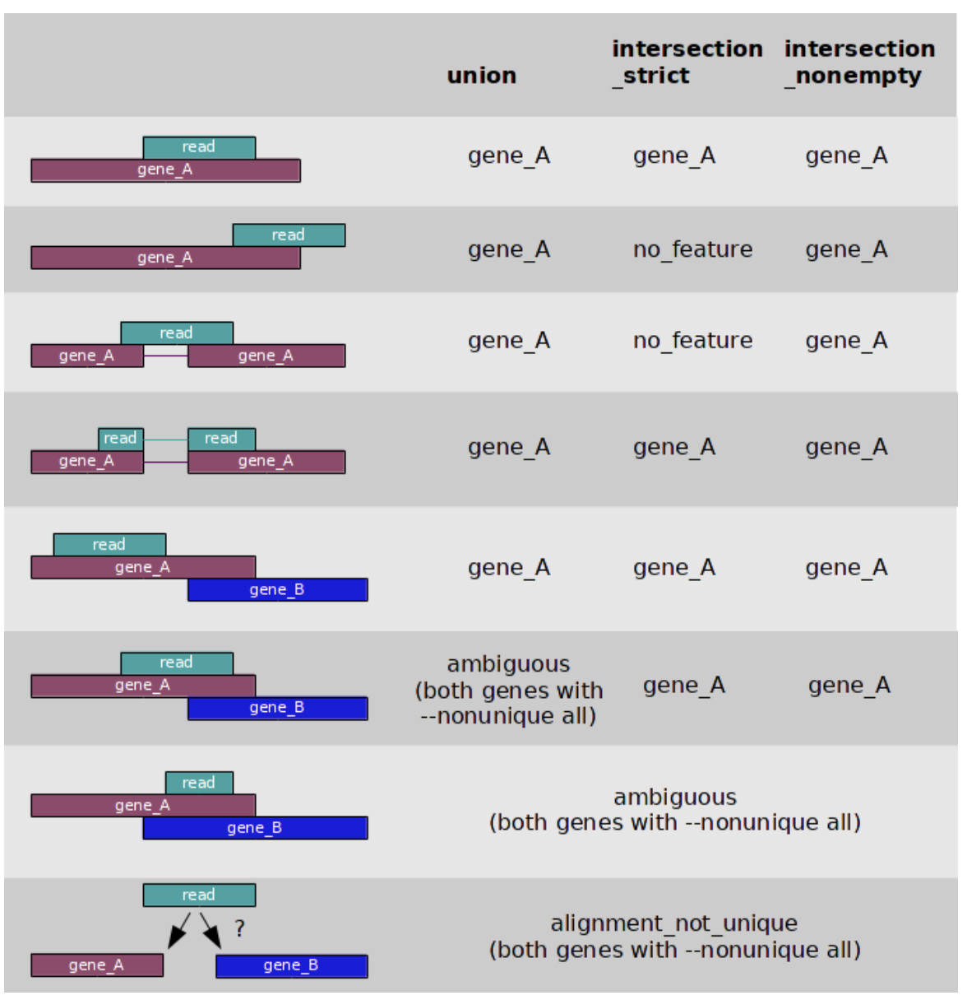

# Part 4 - Read count quantification 

### Learning objectives: 
- Gain understanding of how reads are counted to quantify expression levels in RNA-seq
- Learn how to quantify read counts using `htseq-count`
- Create a gene expression matrix from read count quantifications for the entire dataset

Make a new directory: 
```bash 
mkdir results/quant
cd results/quant
```

## Principle of quantifying read counts for RNA-seq 
For most downstream analyses in RNA-seq, especially differential expression, we care about how many reads aligned to a specific gene, as this tells us about its expression level, which we can then compare to other samples. Inherently, this means that we want to make these data *count-based*, so that we can use statistical models to compare these counts between our experimental conditions of interest. 


There are a number of methods that one can use to quantify reads overlapping a specific features ( in this case, exons). These methods require a .bam file as input, in addition to a list of the genomic features that we wish to count reads over. The most simplistic methods (e.g. [htseq-count](https://htseq.readthedocs.io/en/release_0.11.1/count.html), [featureCounts](http://subread.sourceforge.net/)) use a specific set of rules to count the number of reads overlapping specific features. These are a good choice if your data is less complex, e.g. 3'-end data. 

Other methods leverage probablistic modeling in order to quantify the alignments (e.g. [RSEM](https://deweylab.github.io/RSEM/)), which ascibes reads to features with a probability of this being the correct location for a given read. Generally, these methods are used on more complex data (e.g. full-length transcript and/or paired-end data) where transcript estimates are of interest. 

For our analysis, we will used htseq-count. htseq-count has three distinct modes for handling overlapping features; union, intersection_strict, and intersection_nonempty. You change change these using the `mode` option. The behavious of each setting is described in the figure below, taken from the htseq-count documnetation. Another important (and related) behaviour of htseq-count is how it handles multi-mapping reads (reads that map to > 1 place in the genome). Generally, multimapping reads are discarded during counting to prevent introduction of bias into the counts. 

# Counting modes (from the htseq-count documentation, found [here](https://htseq.readthedocs.io/en/release_0.11.1/count.html))



One of the most important options in htseq-count is `strandedness`. It is critical to select the correct option for `strandedness` (`-s`) for your dataset, otherwise you may incorrectly use, or throw away, a lot of information. The default setting in htseq-count for `strandedness` is `yes`. This means reads will only be counted as overlapping a feature provided they map to the same strand as the feature. If you data was generated using an unstranded library preparation protocol, as in this experiment, we must set this option to `no`. Failiure to do so would mean you would throw away ~50% of all your reads, as they will be distributed equally across both strands for each feature in an unstranded library.  

Another important important option in htseq-count is `t` or `type` which specifies which feature type (3rd column of a GTF file) you want to count features over. The default is `exon` which works for GTF files from Ensembl, such as the file we will be using. However, this can be changed to any feature in your GTF file, so theoretically can be used to count any feature you have annotated. 

When counting paired-end data (such as in this experiemnt) your .bam files should be sorted before running htseq-count, and you can specify how your .bam is sorted using the `-r` option. `name` indicates they are sorted by read name, `pos` indicates they are sorted by genomic position. 

## Run htseq-count on your .bam file 
```bash
htseq-count \
	-f bam \
	-s no \
	-r pos \
	../alignment/SRR1039508.Aligned.out.sorted.bam \
	/dartfs-hpc/scratch/rnaseq1/refs/Homo_sapiens.GRCh38.97.chr20.gtf > SRR1039508.htseq-counts
```

There are numerous settings that can be tweaked and turned on/off in htseq-count. I strongly recommend you **read the manual** before running htseq-count so that you understand all the default options and available settings. 

.... Let it run...

Lets have a look at the resulting file. 
```bash
# how many lines 
wc -l SRR1039508.htseq-counts

# first few rows 
head SRR1039508.htseq-counts

# importantly, lets check the last few rows as these contain some important info 
tail -n 12 SRR1039508.htseq-counts
```

Additional exercise: 
- Can you visually confirm the read count returned in htseq-count by looking at the .bam file in IGV? 

## Run htseq-count on the rest of our samples 
```bash
ls ../alignment/*.Aligned.sortedByCoord.out.bam | while read x; do

  # save the file name
  sample=`echo "$x"`
  # get everything in file name before "/" (to remove '../alignment/')
  sample=`echo "$sample" | cut -d"/" -f3`
  # get everything in file name before "_" e.g. "SRR1039508"
  sample=`echo "$sample" | cut -d"." -f1`
  echo processing "$sample"
  
  htseq-count \
	-f bam \
	-s no \
	-r pos \
	../alignment/${sample}.Aligned.sortedByCoord.out.bam \
	/dartfs-hpc/scratch/rnaseq1/refs/Homo_sapiens.GRCh38.97.chr20.gtf > ${sample}.htseq-counts ;
done
```

## Generate the gene expression matrix of raw read counts

The final step in the pre-processing of RNA-seq data for differential expression analysis is to concatenate your read counts into a gene expression matrix that contains the counts from all your samples. We will do this at the command line, however there are also ways to directly read the output of programs like htseq-count and RSEM directly into R without concatenating them into a matrix before hand (discussed on day2). 


Have a look at the htseq-count output files 
```bash
ls /dartfs-hpc/scratch/rnaseq1/data/htseq-count/
```

Create a sym link to them:
```bash 
# make a sub directory to put them in 
mkdir all_samples
cd all_samples

# create the linke 
ln -s /dartfs-hpc/scratch/rnaseq1/data/htseq-count/*.htseq-counts ./
```

Loop over htseq-count output files and extract the read count column 
```bash
# set up an array that we will fill with shorthand sample names
myarray=()

# loop over htseq.counts files and extract 2nd column (the counts) using 'cut' command
while read x;  do
	# split up sample names to remove everything after "_"
	sname=`echo "$x"`
	sname=`echo "$sname" | cut -d"." -f1`
	# extract second column of file to get read counts only 
	echo counts for "$sname" being extracted
	cut -f2 $x > "$sname".tmp.counts
	# save shorthand sample names into an array  
	sname2="$sname"
	myarray+=($sname2)
done < <(ls -1 *.htseq-counts | sort)
```

This will take a few minutes.. 

Paste all gene IDs into a file with each to make the gene expression matrix
```bash 
cut -f1 SRR1039508.htseq-counts > gene_IDs.txt
paste gene_IDs.txt *.tmp.counts > tmp_all_counts.txt
head tmp_all_counts.txt 
```

Save sample names in the array into text file 
```bash 
# look at the contents of the array we made with shorthand sample names 
echo ${myarray[@]}

# print contents of array into text file with each element on a new line 
printf "%s\n" "${myarray[@]}" > names.txt
cat names.txt
```

Put sample names in the file with counts to form row headers and complete the gene expression matrix
```bash 
# make a file to fill 
touch all_counts.txt

# use the 'cat' command (concatenate) to put all tmp.counts.txt files into all_counts.txt
cat <(cat names.txt | sort | paste -s) tmp_all_counts.txt > all_counts.txt

# view head of file 
head all_counts.txt

# how many lines 
wc -l all_counts.txt
``` 

Remove all the tmp files 
```bash 
rm -f *tmp*
```

In practice, you would have generated the a `.htseq.counts` file using all genes accross the entire genome, and using all of the samples in the dataset, instead of the four samples we used in these examples. So that we have the complete set of counts available for day 2, we have made a complete raw counts matrix for you to use. You can find this in `/dartfs-hpc/scratch/rnaseq1/data/htseq-counts/`. It is also is the GitHub repo that you downloaded in the `Day-2` folder, as we will be loading it into `R` tomorrow for the differential expression analysis. 

```bash 
head /dartfs-hpc/scratch/rnaseq1/data/htseq-count/all_counts.txt
```

