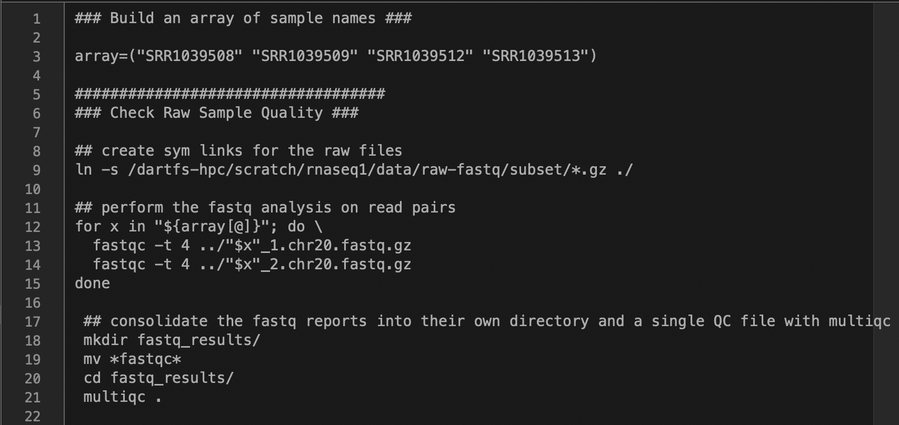

# Putting it all together (pipelining) #
Just like in wet bench experiments it is important that you keep careful track of the programs that were used to process your genomic data. Generally since we process data on the computer we keep a running lab notebook on the computer of all of the commands that were used to process the data. This can simply be a list of each command that was run, or if you want to get sophisticated (and we are all here to learn aren't we) you can write a code that will run through each command succesively using the output from one command to feed into the next command. One of the benefits of writing your code this way is the same code can be used over and over by simply changing the list of sample names in the first lines. Code written this way is generally stored in a text file and written using a text editor. 



This works well if your samples are small or there aren't many of them, however in most cases you will want to parallelize your dta processing to maximize the computational resources of the cluster. To do this you would submit a pbs job to the que using a pipeline like we have made available [here](https://github.com/Dartmouth-Data-Analytics-Core/DAC-rnaseq-pipeline).


As "homework" for day 1 we would like you to build a simple pipeline out of the commands you used to process the samples we worked with today. We will get you started with the first several commands and then you can try filling in the rest. Copy and paste the commands below into a text editor (bbedit, sublime text, notepad ++, kate, etc.) and do your best to fill in the rest of the commands. If you run into trouble leave a slack comment explaining your error(s) and we will do our best to get back to you! 

To start out we are going to create an array with our sample names so that we can use the sample names to control the input and output of each of the commands. 
Then we will use the array to write several for loops that iterate over the elements of the array to do something with them. 

```bash
### Build an array of sample names ### 

array=("SRR1039508" "SRR1039509" "SRR1039512" "SRR1039513")

###################################
### Check Raw Sample Quality ###

## create sym links for the raw files 
ln -s /dartfs-hpc/scratch/rnaseq1/data/raw-fastq/subset/*.gz ./

## perform the fastq analysis on read pairs
for x in "${array[@]}"; do \
  fastqc -t 4 ../"$x"_1.chr20.fastq.gz
  fastqc -t 4 ../"$x"_2.chr20.fastq.gz
done
 
 ## consolidate the fastq reports into their own directory and a single QC file with multiqc
 mkdir fastq_results/
 mv *fastqc*
 cd fastq_results/
 multiqc .

###################################
 ### Read Trimming ###

 ## create a directory for trimmed reads
 mkdir trim/
 cd trim/
 
 ## run the cutadapt command to trim reads
for x in "${array[@]}"; do \
 cutadapt \
  -o "$x"_1.trim.chr20.fastq.gz \
  -p "$x"_2.trim.chr20.fastq.gz \
  ../"$x"_1.chr20.fastq.gz ../"$x"_2.chr20.fastq.gz \
  -m 1 -q 20 -j 4 > "$x".cutadapt.report
done

###################################
### Read Alignment ### 

## create a directory for aligned reads
mkdir alignment/
cd alignment

## run the STAR command to align reads (in this case the index has been built if you are using a different reference file you will need to add a command for building the reference
for x in "${array[@]}"; do \
    STAR --genomeDir /dartfs-hpc/scratch/rnaseq1/refs/hg38_chr20_index \
    --readFilesIn ../trim/"$x"_1.trim.chr20.fastq.gz ../trim/"$x"_2.trim.chr20.fastq.gz \
    --readFilesCommand zcat \
    --sjdbGTFfile /dartfs-hpc/scratch/rnaseq1/refs/Homo_sapiens.GRCh38.97.chr20.gtf \
    --runThreadN 4 \
    --outSAMtype BAM SortedByCoordinate \
    --outFilterType BySJout \
    --outFileNamePrefix "$x".
done

###################################
### Run CollectRNASeqMetrics ### 

###################################
### Run MarkDuplicates ###

###################################
### Move alignment and metrics into a single directory and run multiqc ###

###################################
### Run htseq-count ###

```

