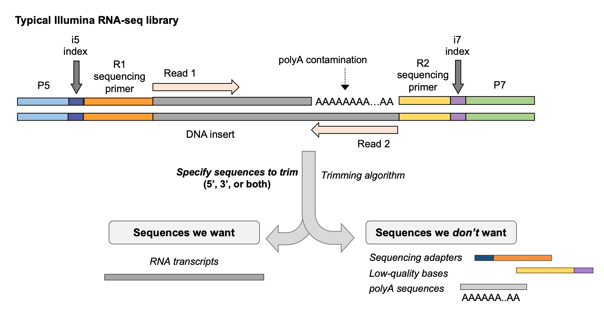
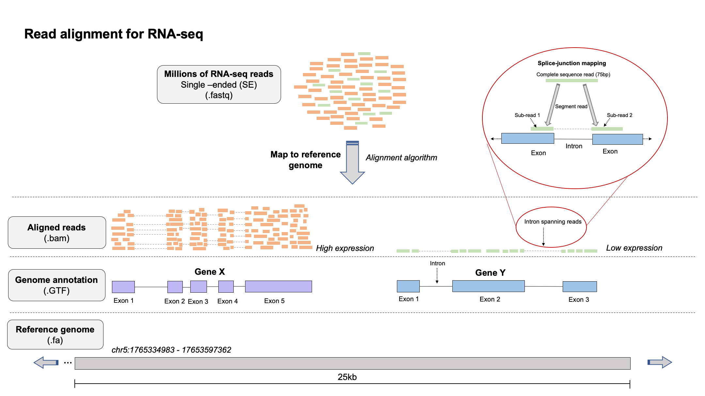
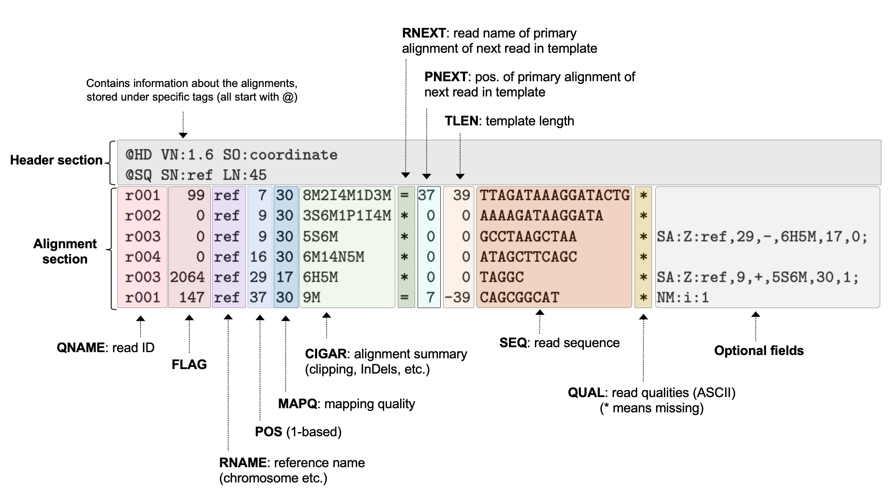
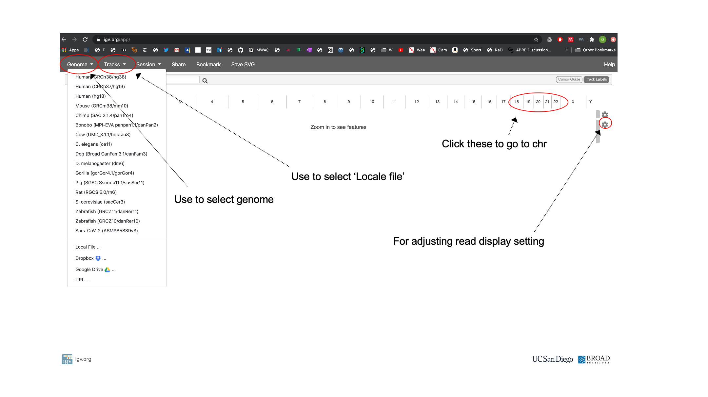
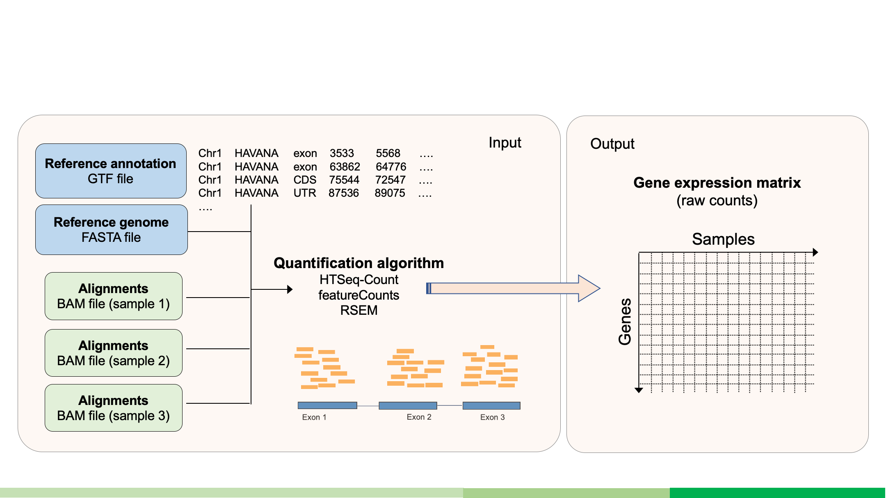
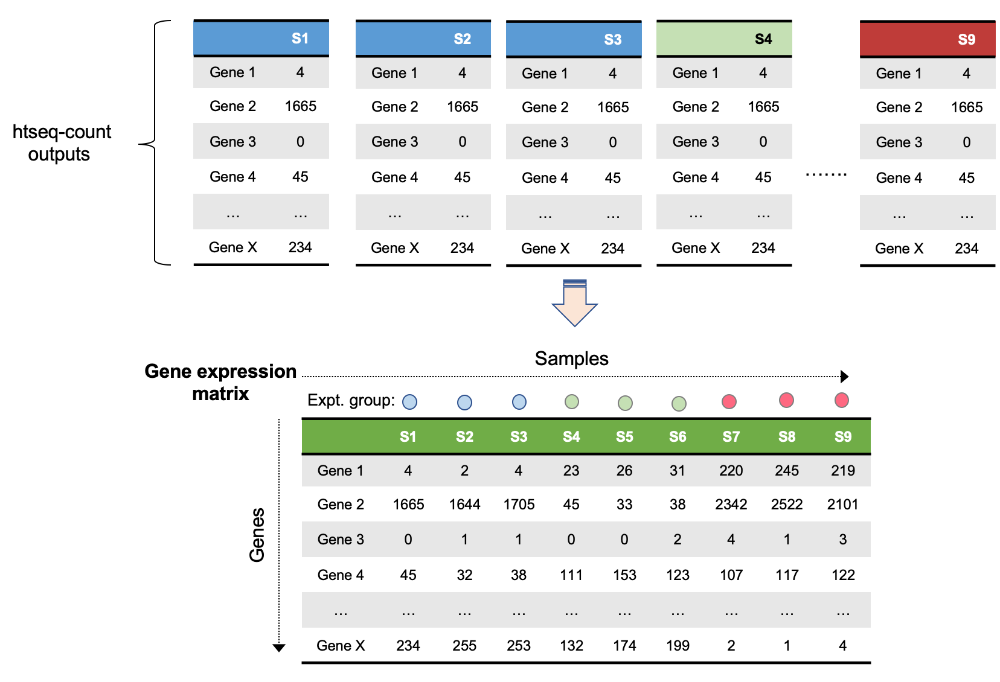

## Day 1 

To DO: 
- trimming section
- post alignment QC
- putting it all together 
- extra exercises throughout 

- introduice dataset
- separate parts into different scripts 


### FASTQ file format

FASTQ files are arguably the workhorse format of bioinformatics. FASTQs are used to store sequence reads generated in next-generatoon sequencing (NGS) experiments. Similarly to FASTA files, FASTQ files contain a herder line, followed by the sequence read, however individual quality of base calls from the sequencer are included for each record in a FASTQ file. 

Here is what a the first record of an example FASTQ file looks like
```
@SRR1039508.1 HWI-ST177:290:C0TECACXX:1:1101:1225:2130 length=63
CATTGCTGATACCAANNNNNNNNGCATTCCTCAAGGTCTTCCTCCTTCCCTTACGGAATTACA
+
HJJJJJJJJJJJJJJ########00?GHIJJJJJJJIJJJJJJJJJJJJJJJJJHHHFFFFFD
```

**Four rows exist for each record in a FASTQ file:**
- Row 1: Header line that stores information about the read (always starts with an `@`), such as the *instrument ID*, *flowcell ID*, *lane on flowcell*, *file number*, *cluster coordinates*, *sample barcode*, etc.
- Row 2: The sequence if bases called
- Row 3: Usually just a `+` and sometimes followed by the read info. in line 1
- Row 4: Individual base qualities (must be same length as line 2

Quality scores, also known as **Phred scores**, in row 4 represent the probability that the associated base call is incorrect, which are defined by the below formaula for current Illumina machines:
```
Q = -10 x log10(P), where Q = base quality, P = probability of incorrect base call

or 

P = 10^-Q/10
```

Intuitively, this means that a base with a Phred score of `10` has a `1 in 10` chance of being an incorrectly called base, or *90%*. Likewise, a score of `20` has a `1 in 100` chance (99% accuracy), `30` a `1 in 1000` chance (99.9%) and `40` a `1 in 10,000` chance (99.99%). 

However, we can clearly see that these are not probabilities. Instead, quality scores are encoded by a character that is associated with an *ASCII* code (equal to the *Phred-score +33*). The reason for doing it this way is so that quality scores only take up 1 byte per value in the FASTQ file. 

For example, the first base call in our sequence example above, the `C` has a quality score encoded by an `H`, which corresponds to a Q-score of 39, meaning this is a good quality base call. 

Generally, you can see this would be a good quality read if not for the strech of `#`s indicating a Q-score of 2. Looking at the FASTQ record, you can see these correspond to a string of `N` calls, which are bases that the sequencer was not able to make a base call for. Streches of Ns' are generally not useful for your analysis. 

You can read more about quality score encoding [here](https://support.illumina.com/help/BaseSpace_OLH_009008/Content/Source/Informatics/BS/QualityScoreEncoding_swBS.htm), and view the full table of symbols and *ASCII* codes used to represent Q-scores. 

**Paired-end reads:**  

If you sequenced paired-end reads, you will have two FASTQ files:  
*..._R1.fastq* - contains the forward reads  
*..._R2.fastq*- contains the reverse reads  

Most downstream analysis tools will recognize that such files are paired-end, and the reads in the forward file correspond to the reads in the reverse file, although you often have to specify the names of both files to these tools. 

It is critical that the R1 and R2 files have **the same number of records in both files**. If one has more records than the other, which can sometimes happen if there was an issue in the demultiplexing process, you will experience problems using these files as paired-end reads in downstream analyses. 

### Working with FASTQ files 

While you don't normally need to go looking within an individual FASTQ file, it is very important to be able to manipulate FASTQ files in you are going to be doing any more involved bioinformatics. There are a lot of operations we can do with a FASTQ file to gain more information about our experiment, and being able to interact with FASTQ files can be useful for troubleshooting problems that might come up in your analyses. 

Due to their large size, we often perform gzip copmpression of FASTQ files so that they take up less space, however this means we have to unzip them if we want to look inside them and perform operations on them. We can do this with the `zcat` command. 

Lets use `zcat` and `head` to have a look at the first few records in our FASTQ file. 
```bash
zcat sample.fastq.gz | head
```

How many records do we have in total? (don't forget to divide by 4..) 
```bash
zcat sample.fastq.gz | wc -l
```

How do we capture specific lines of each record recursively?
```bash
zcat sample.fastq.gz | wc -l
```

What if we want to count how many unique barcodes exist in the FASTQ file. 
```bash
zcat sample.fastq.gz | sed -n '2~4p' | head -10000 | grep -o .
```
Using sed with the -n option and '2~4p' will return the 2nd line, skip to 4 lines, and print again, recursively. We can use head to view this for the first 10,000 lines. 

Next, we can use grep to find all of the instances of each nucleotide across these lines. 
```bash
zcat sample.fastq.gz | sed -n '2~4p' | head -10000 | grep -o .
```

Finally we can sort and count up the unique nucleotides that were found..
```bash
zcat sample.fastq.gz | sed -n '2~4p' | head -10000 | grep -o . | sort | uniq -c
```
Now we have the number of each nuleotide across the reads from the first 1000 records. A quick and easy program to get GC content! 

### Searching for regular expressions

What if we wanted to find matches for a specific sequence, maybe after a start codon, in the FASTQ file 
```bash
zcat sample.fastq.gz | grep -o "ATGGGATCA" | sort | uniq -c
```

Perhaps this sequence represents some a contaminating sequence from the run that we want to quickly screen all of our samples for (e.g. from bacteria). We can do this by searching for matches and counting how many times it was found, and repeating this process for each sample using a for loop. 
```bash
ls *.fastq.gz | 
for read x; do 
    echo $x is being processed...; zcat $x | grep -o "ATGGGATCA" | sort | uniq -c; 
done
```
TO DO, need to get a real sequence, or change the exercise a little
Could we use an adapter sequence to check if the adapters need to be trimmed? I can't imagine a small string that would represent bacterial contamination, but an adapter sequence would be pretty appropriate and lead right into trimming.

- Running this using an executable shell script

- 1 Example of same stuff with a FASTA file 

- Running in the background with nohup 

The value of these sorts of tasks may not be immediately clear, but as we start piping together these operations we can calculate useful metrics and gain some basic insight into the reads in the file as a whole. Such operations are used by common bioinformatics tools under the hood to perform routine tasks.

<br>

### Pre-processing and quality control of raw data 

Before you begin working with genomic data it is important to asses the quality of the data, look for possible contamination, and get an idea of what you can expect the assembled product to look like. The distribution of base qualities, the distribution of read lengths, GC bias, and duplication rates are all informative metrics for assessing raw sequencing data. 

FastQC runs several 'analysis' modules on the raw FASTQ files that allow us to evaluate the quality of that sample, and identify potential quality issues that need to be addressed in the downstream analysis steps. Many short reads, skewed GC content, and high duplication rates can indicate contamination by adapters, bacteria, etc. 

```bash
fastqc infile.fq.gz --outdir=fastqc_out
```
Lets have a look at a typical HTML report. 

[Good Illumina Data FastQC Report](https://www.bioinformatics.babraham.ac.uk/projects/fastqc/good_sequence_short_fastqc.html)

[Bad Illumina Data FastQC Report](https://www.bioinformatics.babraham.ac.uk/projects/fastqc/bad_sequence_fastqc.html)


<br>
 

Openning 1 HTML file at a time to do this is annoying, so we use a tool called MultiQC to aggregate these reports together. 
```bash
multiqc .
```
MultiQC is very flexible and comprehensive, and will process output from many bioinformatics programs (FastqQC, cutadapt, STAR, picard, samtools), so we can use it to do more QA/QC and collect key metrics later in the pre-processing steps. More on this later. 


<br>

### Read pre-processing & trimming  
#### Principles of read trimming: Downstream steps are more efficient
Read trimming is used to clean up the library of raw reads. Trimming can be used to trim adapter sequences, polyA tails, low quality bases, or reads that are too short. Mostly trimming is used to remove low quality bases, generally 20 is the lowest filter we would recommend for quality trimming. 





#### Example command for read trimming with cutadapt 
(If you use Cutadapt, please cite DOI:10.14806/ej.17.1.200)

Usage:
    
cutadapt -a ADAPTER [options] [-o output.fastq] input.fastq

For paired-end reads:

cutadapt -a ADAPT1 -A ADAPT2 [options] -o out1.fastq -p out2.fastq in1.fastq in2.fastq

```bash
cutadapt -a 'A{76}' -m 5 --nextseq-trim=20 -o "$i".trimmed.fq.gz "$i"_R1_001.fastq.gz >"$i".cutadapt.out;
```
-a trims adapters from the 3' end
-g trims adapters from the 5' end
-b trims adapters from both ends
-m trims reads that are samller than the minimum threshold (length is measured after all quality and adapter trimming)
-q qulaity threshold for trimming bases

--nextseq-trim works like q=20 except that quality scores on Gs are ignored, this accomodates the effects of dark cycles from some illumina instruments that leave a string of high quality but in correct Gs at the 3' end of reads

-o output file

<br>


### Read alignment  

Aligning millions of reads to very large reference genomes (such as the human genome) is generally done by splitting the reads and reference into a catalog of shorter reads with unique sequnece structures (kmers). It is improtant when selecting an alignement program to ensure that it is appropriate for the dataset you are working with, for example STAR (Spliced Transcripts Alignment to a Reference) is used to align reads that have come from spliced transcripts. A single read from a spliced transcriptome might map across a splice junction, such that the left side of the read and the right side of the read map hundreds of base pairs apart. If your dataset is prokaryotic (non-splicosomal) this would not be the appropriate program for you to align your reads, we would suggest looking into bwa-mem or bowtie2. If you are in a hurry and not interested in obtaining read alignments and only need count data quasi-mapping with a tool like Salmon might be a good option. 



#### Concepts for read alignment 

**Read clipping**
Aligners are capable of 'clipping' reads from sequence ends if they do not improve the quality of an alignment that exists for the rest of the sequence.  

There are two type of clipping:  
- *Soft-clipping*: bases at 5' and 3' ends of the read will be kept in the read sequence in the BAM file, but are NOT part of the alignment
- *Hard-clipping*: bases at 5' and 3' ends of the read will be removed from the BAM file altogether and are NOT part of the alignment 

Such clipping is commonly used by aligners to get rid of sequence contamination, e.g. adapter sequences or polyA tails from mRNAs, so that it does not affect the alignment. At least for RNA-seq, this is why you do not necessairily need to be very aggressive in read trimming and pre-processing steps. 

Clipping can be very advantageous, but also can potentially cause some issues, read more [here](https://sequencing.qcfail.com/articles/soft-clipping-of-reads-may-add-potentially-unwanted-alignments-to-repetitive-regions/). 

**Splicing**
Several different aligners exist, and one particularly important feature of an aligner is whether or not it is *splie-aware*. Splice-aware aligners, such as `STAR` and `HISAT2` are able to map reads over splice junctions by spanning the intronic region. This is obviously an important characteristic for RNA-seq data. Furthermore, if you provide coordinates of splice-junctions during alignment to aligners like STAR, it can improve the mapping over spliced regions and improve detection of novel splice-functions. 

**Genome vs transcriptome mapping?**
While there are times when one may want to map to a transcriptome, there are issues with this approach.  
- If your annotated transcriptome is not complete, you may fail to map some reads simply because the sequences aren't in your reference, which would not be as much of an issue if you mapped to the genome. 
- It is difficult to disambiguate which splice isoform a read should be aligned to in transcriptome mapping 
- Can't really idengtify novel transcripts this way

**What input do I need for an alignmnet?**
At miniumum:  
- `FASTQ` file(s)
- A reference genome (`.fasta`)

Optional: 
- `.gtf` file for the reference genome that species the geneomic feature annotation. As mentioned below, if you know where the splice-junctions in your genome are, you can give this to aligners such as STAR and they will use this information to improve the quality of mapping in these regions. 

**Alignment file formats**

Read alignments are stored in the SAM (.sam) and BAM (.bam) file format. SAM stands for *Sequence Alignment/Map* format and is in tab-delimited text format, making it a human readable file (should you dare to look inside). Bam files are the compressed, indexed, binary version of SAM files and are NOT human readable, but are much fatsre to parse and do complex operations on. You can read all about the SAM/BAM file format specification in the documentation [here](https://samtools.github.io/hts-specs/SAMv1.pdf). While you may never need to actually look inside of a SAM/BAM file, its important to have an understanding of what information is stored in one. 

Both formats contain a number of slots for each read alignment that describe key information about the alignment. 11 slots are mandatory, while others are optional and depend on the aligner used, and the settings used in that alignment.


The image for the example BAM file is take from the [SAM/BAM file format documentation](https://samtools.github.io/hts-specs/SAMv1.pdf)

Notes on select fields:

**FLAG** encodes important information about the read, for example, is it a primary, secondary, or supplementary alignment. Since one read will likely have a number of properties that we want to 'flag', SAM files use a special way of encoding the FLAG field to pack as much information as possible into one number. While we won't go into detail on this here, it works by decomposing large numbers into their constituents. I encourage you to go read more about FLAGs and how they are specified.  

Try running this to get basic information on FLAGs from samtools. 
```bash 
samtools flags
```

**MAPQ** corresponds to the quality of the mapping. These are calculated in the same way as the Phred scores `Q = -10 x log10(P)`, although are generally considers best guesses form the aligner. A MAPQ of 255 is used where mapping quality is not available. Some aligners also use specific values to represent certain types of alignments, which may affect use of downstream tools, so it is worth understanding those that are specific to your aligner. 

**CIGAR** is an alphanumerical string that tells you information about the alignment. For relatively short reads, these are nice, but for long reads, they are a headache. Numbers correspond to number of bases, and letters correspond to features of those bases.  

Letter key for CIGAR strings: 
M = match or mismatch  
S = soft clip  
H = hard clip  
I = insertion  
D = deletion  
N = skipping  

So for example, alignment in row 3 of our SAM file example above (`5S6M`) would describe an alignment where 5 bases are soft-clipped, followed by 6 matching bases. 

Now lets have a look at the header for our SAM file:
```bash 
samtools view -H tmp.chr22.sam  | head
```

Lets also have look at the first few alignment records in our BAM file
```bash 
samtools view tmp.chr22.sam  | head
```

#### STAR (Spliced Transcripts Alignment to a Reference)
STAR is a very flexible, efficient, and quick read aligner. It uses a method of seed searching, clustering, stitching, and scoring to find the most probable match in the reference sequence for each read. A seed is the longest possible match between a read and the reference sequence. By using multiple seeds on a single read, reads are able to span hundreds of base pairs across splice junctions. Once a read is mapped into multiple seeds STAR attempts to map the remaining unmapped portions of the read by extending the seed match allowing for indels and mismatches. Any portion of the read that cannot be mapped is assumed to be contamination, leftover adapter sequences, or an incorrect base call and these bases are clipped (called soft-clipping). I encourage you to go look through the [user manual](https://github.com/alexdobin/STAR/blob/master/doc/STARmanual.pdf) if you plan to use STAR. 

#### Constructing a genome index 

Before running an alignment with STAR, you need to create an index of your reference genome, and specify the location of this index when you run the aligner. The index is in principle similar to how one might index a book, so that specific items or information can be found more quickly. For the genome index, we are indexing the genome so that the aligner can narrow down where a read may map to, help us to quickly index the genome and speed up mapping. 

For the purposes of this workshop and saving time, we have pre-built created a small genome index consisting of only chromosome 22. In practice you would use the entire genome. Generating the index can be time consuming so we won't run it now, but the command to do this would be: 
```bash 
STAR --runThreadN 16 \
--runMode genomeGenerate \
--genomeDir hg38_index \
--genomeFastaFiles Homo_sapiens.GRCh38.dna.primary_assembly.fa \
--sjdbGTFfile Homo_sapiens.GRCh38.97.gtf \
--sjdbOverhang 99 \
```

Option details: 
- `--runThreadN`: no. of core/threads you want to use
- `--runMode`: the mode you want to run STAR in (for index generation, this should be genomeGenerate)
- `--genomeDir`: directory you want your genome to go to
- `--genomeFastaFiles`: path to genome .fasta 
- `--sjdbGTFfile`: path to genome annotation in .gtf format
- `--sjdbOverhang`: default is 100, usually set to the readlength -1

You can find the pre-built index at `/dartfs-hpc/rc/lab/`. 

Once you have generated an index, it is best not to do anything with it, except tell STAR where it is when you want to align reads. 

#### Aligning the reads

We are ready to align our reads to the genome. 

```bash
STAR --genomeDir /dartfs-hpc/rc/myind \
--sjdbGTFfile /dartfs-hpc/rc/mygene \
--sjdbOverhang 100 \
--runThreadN 10 \
--outFilterType BySJout \
--outSAMtype SAM \
--readFilesIn trimed_R1_fastq \
--readFilesCommand zcat \
--outFileNamePrefix Sample_ID\
```

Option details: 
- `--genomeDir`: the path to the directory with genome indices
- `--sjdbGTFfile`: the path to the annotation file that includes cooordinates of splice-junctions
- `sjdbOverhang`: length of the sequence around the splice junction to be used in constructing the splice junctions database
- `--runThreadN`: number of threads to use in the run
- `--outFilterType`: how mapped reads will be filtered (normal/BySJout)
- `--outSAMtype`: (BAM unsorted/ BAM SortedByCoordinate)
- `--readFilesIn`: read files to map to reference alignment
- `--readFilesCommand`: uncompression command to apply to read files
- `--outFileNamePrefix`: prefix for outfiles generated in the run

Now, simply wait...

There are a number of other options you may wish to specify, dependning on your application and downstream analysis. These are the barebones options suggested for RNA-seq differential expression analysis. Again, I encourage you to go look through the [user manual](https://github.com/alexdobin/STAR/blob/master/doc/STARmanual.pdf) if you plan to use STAR. 

**Aligment output**

Once the alignment has finished, you should have a number of new files in your directory. These are composed of:  
- `.bam` - your alignment file
- `Log.out` - the log of the STAR run 
- `Log.final.out` - the summary filke of the mammping statsistics
- `Log.progress.out` - a summary file that is updated with key mapping statistics as the run progresses
- `SJ.out.tab` - high-confidence splice-functions 

It is very important to do a detailed quality control review of your alignments across all your samples to identify any potential issues. We are going to (later) build a detailed multi-sample QC report using an independent tool, however we can have a quick look at the `Log.final.out` file from STAR as this contains the major mapping stats that we want to look at to assess how well reads were mapped to the reference. 

```bash
cat x.final.out 
``` 

**Working with SAM/BAM files**  
We can also have a look around our SAM file to get to know it a bit better. Several tools exist that enable you to perform operations on SAM/BAM files. `Samtools` is perhaps the most widely used of these, and is used widely. You can find the documentation [here](http://www.htslib.org/doc/samtools.html). 

For example, we may wich to sort our BAM file by coordinate (required by several tools that accept BAM as input):
```bash
samtools sort s.bam
``` 

We may then wish to index our BAM, which will create a file with the same name, but the suffix `.bai`. An index 
```bash
samtools index s.sorted.bam
``` 
In practice, we can ask programs like STAR to give us indexed and sorted BAM files as output from the alignment, however this is not the case with all aligners. 

Another useful thing we might want to do with our BAM file is to count how many alignments have specific FLAG types (unique alignments, secondary, unmapped, properly paired). 
```bash
samtools flagstat s.sorted.bam 
``` 

We can even use the specific FLAGs in the BAM file to extract specific alignments. For example, you might want to produce BAM files where all of the reads mapping to the forward and reverse strands are in separate files: 
```bash
# use -f option in view to filter for reads with FWD alignment flag (20)
samtools view -f 20 s.sorted.FWD.bam

# use -f option in view to filter OUT reads with FWD alignment flag (20), ultimately giving REV reads 
samtools view -F 20 s.sorted.REV.bam
``` 

You might just want to count how many reads have a particular SAM flag
```bash
# count how many reads are NOT a primary alignment (FLAG=256)
samtools view -c -F 256 s.sorted.bam
```

Finally, if we wish, we could convert out SAM to a BAM (usually I just go straight to BAM..)
```bash
# count how many reads are NOT a primary alignment (FLAG=256)
samtools view -c -F 256 s.sorted.bam
```

<br>

## Viewing Alignments in IGV

The Integrative Genomics Viewer (IGV) from the Broad Institute is an extremely useful tool for visulazation of alignment files (as well as other genomic file formats). Viewing your alignments in this way can be used to explore your data, troubleshoot issues you are having downstream of alignment, and inspect coverage for and quality of reads in specific regions of interest (e.g. in variant calling). I strongly encourage you to download the IGV for your computer from their [website](http://software.broadinstitute.org/software/igv/) and play around with some BAM file to get familar with all its various features. 

Here, we will create a small subset of a BAM file, download it onto our local machines, and view it using the IGV web app (for speed). You can open the IGV web app in your browser [here](https://igv.org/app/). 

Lets go ahead and subset our BAM file for reads aligning only to chromosome 22. We also need to create an index. 
```bash
# subset for reads just on chr 22 (to make it smaller)
samtools view -b -@ 8 -o chr22.bam SRR1039508_1.Aligned.sortedByCoord.out.bam 22

# index your new bam file 
samtools index chr22.bam
``` 

Now download the files onto your local machine, so that you can load them into the IGV web app. 
```bash
# make a directory and go into it 
mkdir rnaseq_wrksp/
cd rnaseq_wrksp/

# download the file using secure copy (scp)
##### modify this for your discovery ID, AND the directory your in 
scp d41294d@discovery7.dartmouth.edu:/dartfs-hpc/rc/lab/G/GMBSR_bioinfo/workshops/rnaseq-july20/data/bam/chr22.bam* .
##### you will be promoted for your password for discovery/polaris 

# you may also need to modify the permissions 
chmod a+rwx chr22*
```

Now navigate to the IGV web app, and follow the below steps:  
1. Under *'Genomes'* in the top right, select *'GRCh38/hg38'*
2. Under *'Tracks'* select *'Local file'*, then highlight both the .bam and .bai 
3. Navigate to chromosome 22, and zoom in on ...
4. Use the setting at the side of the track to set colors by *read strand*



- Can you find an example of a highly expressed gene?
- What do you notice about the orientation of the aligning reads? 
- Why might this cause ambiguity in read quantification for genes that overlap?  


### Post-alignment quality control 
Once you have aligned your reads, it is important to assess how well our reads could be mapped to the reference genome. The primary metric of a successful alignment is the **percentage of uniquely mapped reads**, and while this depends on the organism and reference genome you map to, a good quality sample is expected to have ~75% of its read uniquely mapped. As we did above,  


#### CollectRNASeqMetrics 


This tool will generate a file with several metrics relating to the quality of the alignment. These metrics can be used to diagnose problems with the library that can either be mitigated or taken into consideratoin in assessing the alignment of the data. Metrics reported include the dsitribution of bases within transcripts, the total number and fraction of nucleotides within genomic regions (UTR, introns, exons, intragenic regions, etc.), the number of bases that pass wuality filters, median coverage, the ratio of 5' to 3' biases, and the number of reads designated to the correct strand. 

```bash 
java -jar picard.jar CollectRnaSeqMetrics I=input.bam O=output.RNA_Metrics REF_FLAT=ref_flat.txt STRAND=SECOND_READ_TRANSCRIPTION_STRAND RIBOSOMAL_INTERVALS=ribosomal.interval_list
      
 ```
 I= input aligned bam file
 
 O= output RNAseq metrics
 
 REF_FLAT= Gene annotations in refFlat form. Format described here: http://genome.ucsc.edu/goldenPath/gbdDescriptionsOld.html#RefFlat
 
 STRAND= For strand-specific library prep. For unpaired reads, use FIRST_READ_TRANSCRIPTION_STRAND if the reads are expected to be on the transcription strand.
 
 RIBOSOMAL_INTERVALS= Location of rRNA sequences in genome, in interval_list format. If not specified no bases will be identified as being ribosomal. Format described here: http://samtools.github.io/htsjdk/javadoc/htsjdk/htsjdk/samtools/util/IntervalList.html


 
### Duplicates in RNA-seq 

Library preparation for RNA-seq generally involves PCR amplification of the input material to ultimately generate enough cDNA for sequencing. PCR amplification can introduce bias into RNA-seq libraries as it is known that not all fragments are amplified as efficiently as others, and is affected by features such as GC content and fragment length. Furthermore, on certain Illumina sequencers, an independent type of duplicate can occur, called *optical duplicates*, where large clusters formed on the flowcell during sequencing are called as two separate clusters. While removal of true duplicate reads would be the ideal solution toward correcting for this type of bias, their identification is complicated by the fact that we expect read duplicates to occur in RNA-seq data through independent sampling of RNA fragments. In particular, for genes that are expressed at high levels, it is likely reads with the same start- and end-positions will occur, even though these reads originate from separate RNA fragments and therefore should be counted independently during quantification of expression. Therefore, identfication of true duplicates reads from those originating from independent sampling is not possible in most RNA-seq data, and cannot be done effectively for single-end datasets. 

#### Duplicate removal 

Generally, most people **do not** remove duplicates from their RNA-seq data, as several studies have shown that their presence does not substantially bias differential expression analysis or dramatrically reduce statistical power, [provided the library is sufficiently complex](https://www.nature.com/articles/srep25533). Furthermore, de-duplication could introduce its own form of bias as read duplicates from separate RNA fragments will be incorrectly merged. 

Despite these considerations, there is still value in checking the levels of read duplication among your aligned reads, to ensure extreme levels of duplication do not exist. We can do this with the [**MarkDuplicates**](https://gatk.broadinstitute.org/hc/en-us/articles/360036834611-MarkDuplicates-Picard-) from *Picard Tools*. *MarkDuplicates* works by comparing the coordinates, orientation, and sequence of read pairs in an input SAM/BAM file. Completion of *MarkDuplicates* will generate a text file with the suffix `xxx.markduplicates_metrics.txt` that documents key duplication statistics that can be included in our QC report.  

To run *MarkDuplicates*, we call the jar file for *Picard tools* and specify the input SAM/BAM file. 
```bash 
java -Xmx32G -jar picard.jar \
MarkDuplicates \
I=myInBam \
O=myOutBam \
M=myTxt \
OPTICAL_DUPLICATE_PIXEL_DISTANCE=100 \
CREATE_INDEX=false
```

**Option descriptions**: 
`I`=input aligned bam file
`O`=output with duplicate reads marked
`M`=file to write duplication metrics to
`OPTICAL_DUPLICATE_PIXEL_DISTANCE`= The maximum offset between two duplicate clusters in order to consider them optical duplicates
`CREATE_INDEX`=(TRUE/FALSE) Whether to create a BAM index when writing a coordinate-sorted BAM file.

We then just need to make sure the `xxx.markduplicates_metrics.txt` file in included a subdirectory when we run `MultiQC`, and it will be included in the report. 

**Additional note:** If you have very low levels of starting material that will require a lot of PCR amplification, if you plan to sequence **very** deeply, or if removal of true duplicate reads is of particular importance to your experiment, you should consider using a library preparation method that leverages unique molecular identifiers (UMIs), which allow true read duplicates to be effectively identified and removed.  

#### Generating the QC report with MultiQC

Viewing each the output from the aligner, `CollectRNASeqMetrics`, `MarkDuplicates`, etc. would obvbiously be very tideous, so we need some way of aggregating all of these data into one place so that we can compare across the whole dataset. 

`MultiQC` is a very useful tool that synthesizes interactive reports using the output from many commonly used bioinformatics tools. When `MultiQC` is called on a directory, it will search through all subdirectories for file types that it recognizes, and include them in its report. The result is a browsable, sharable, and interactive HTML file containing all of the QC results from our entire dataset. 

`MultiQC` is simply run in the command line by specifying the oparent directory where all of the fikles you wish to be included in your report are located. 
```bash
multiqc . 
```


## Read count quantification  

For most downstream analyses in RNA-seq, especially differential expression, we care about how many reads aligned to a specific gene, as this tells us about its expression level, which we can then compare to other samples. Inherently, this means that we essentially want to make these data *count-based*, so that we can use statistical models to compare these counts between our experimental conditions of interest. 



There are a number of methods that one can use to quantify reads overlapping a specific features ( in this case, exons). These methods require a .bam file as input, in addition to a list of the genomic features that we wish to count reads over. The most simplistic methods (e.g. [htseq-count](https://htseq.readthedocs.io/en/release_0.11.1/count.html), [featureCounts](http://subread.sourceforge.net/)) use a specific set of rules to count the number of reads overlapping specific features. These are a good choice if your data is less complex, e.g. 3'-end data. 

Other methods leverage probablistic modeling in order to quantify the alignments (e.g. [RSEM](https://deweylab.github.io/RSEM/)), which ascibes reads to features with a probability of this being the correct location for a given read. Generally, these methods are used on more complex data (e.g. full-length transcript and/or paired-end data) where transcript estimates are of interest. 

For our analysis, we will used htseq-count. htseq-count has three distinct modes for handling overlapping features; union, intersection_strict, and intersection_nonempty. You change change these using the `mode` option. The behavious of each setting is described in the figure below, taken from the htseq-count documnetation. Another important (and related) behaviour of htseq-count is how it handles multi-mapping reads (reads that map to > 1 place in the genome). Generally, multimapping reads are discarded during counting to prevent introduction of bias into the counts. 


One of the most important options in htseq-count is `strandedness`. It is critical to select the correct option for `strandedness` (`-s`) for your dataset, otherwise you may incorrectly use, or throw away, a lot of information. The default setting in htseq-count for `strandedness` is `yes`. This means reads will only be counted as overlapping a feature provided they map to the same strand as the feature. If you data was generated using an unstranded library preparation protocol, as in this experiment, we must set this option to `no`. Failiure to do so would mean you would throw away ~50% of all your reads, as they will be distributed equally across both strands for each feature in an unstranded library.  

Another important important option in htseq-count is `t` or `type` which specifies which feature type (3rd column of a GTF file) you want to count features over. The default is `exon` which works for GTF files from Ensembl, such as the file we will be using. However, this can be changed to any feature in your GTF file, so theoretically can be used to count any feature you have annotated. 

When counting paired-end data (such as in this experiemnt) your .bam files should be sorted before running htseq-count, and you can specify how your .bam is sorted using the `-r` option. `name` indicates they are sorted by read name, `pos` indicates they are sorted by genomic position. 

# run htseq-count on your .bam file 
```bash
htseq-count \
	-f bam \
	-s no \
	-r pos \
	./pipeline.out/alignment/${i}Aligned.sortedByCoord.out.bam \
	/dartfs-hpc/rc/lab/G/GMBSR_bioinfo/genomic_references/human/ensembl-annotations/Homo_sapiens.GRCh38.97.gtf > ${i}.htseq-counts
```

There are numerous settings that can be tweaked and turned on/off in htseq-count. I strongly recommend you **read the manual** before running htseq-count so that you understand all the default options and available settings. 

.... Let it run...

Lets have a look at the resulting file. 
```bash
# first few rows 
head out.htseq.counts

# importantly, lets check the last few rows as these contain some important info 
tail -n 12 out.htseq.counts
```

Exercise: 
- Can you visulaly confirm the read count returned in htseq-count by looking at the .bam file in IGV? 

# Generate the gene expression matrix of raw read counts

The final step in the pre-processing of RNA-seq data for differential expression analysis is to concatenate your read counts into a gene expression matrix that contains the counts from all your samples. We will do this at the command line, however there are also ways to directly read the output of programs like htseq-count and RSEM directly into R without concatenating them into a matrix before hand. 



Have a look at the htseq-count output files 
```bash
ls -1 *.htseq-counts | sort
```

Loop over htseq-count output files and extract the read count column 
```bash
# set up an array that we will fill with shorthand sample names
myarray=()

# loop over count files using a while loop 
while read x;  do 
	# split up sample names to remove everything after "_trim"
	sname=`echo bash misc/split.sh "$x" "_trim"`
	# extract second column of file to get read counts only 
	echo counts for `$sname` being extracted
	cut -f2 $x > `$sname`.tmp.counts
	# save shorthand sample names into an array  
	sname2=`$sname`
	myarray+=($sname2) 
done < <(ls -1 *.htseq-counts | sort) 
```

Paste all gene IDs into a file with each to make the gene expression matrix
```bash 
paste gene_IDs.txt *.tmp.counts > tmp_all_counts.txt
head tmp_all_counts.txt 
```

Save sample names in the array into text file 
```bash 
# look at the contents of the array we made with shorthand sample names 
echo ${myarray[@]}

# print contents of array into text file with each element on a new line 
printf "%s\n" "${myarray[@]}" > names.txt
cat names.txt
```

Put sample names in the file with counts to form row headers and complete the gene expression matrix
```bash 
cat <(cat names.txt | sort | paste -s) tmp_all_counts.txt > all_counts.txt
head all_counts
``` 

Remove all the tmp files 
```bash 
rm -f *tmp*
```

<br>


### Homework: 
- Catch-up if needed
- Exercises (if time)
- Bring questions of discussion points for end of day 2


### Exercises? (if time, could be take home) 
Just ideas...

1. All of your samples show good quality alignment %s except for one, which has an alignment rate of 55%?  
You noted when doing QC of the raw FASTQ files that this sample has many duplicated sequences.  
What might these sequences represent and how could you quickly test this?


