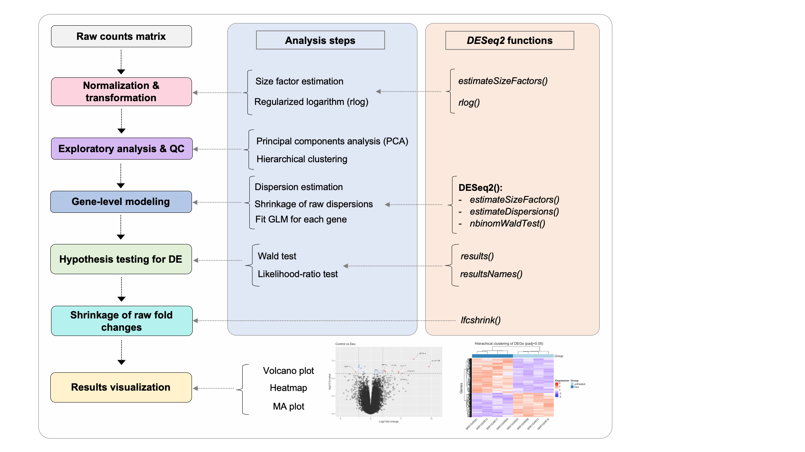

# Wrap-up - Day 1 

### Recap: 
We have implemented the basic steps involved in *data-reduction* of an RNA-seq dataset from raw FASTQ files to a gene expression matrix. Tomorrow, we will focus on the statistical analysis of this count data to identify differentially expressed genes, and perform a basic functional enrichment analysis. 

### Day 1 analysis overview

### Day 2 overview

