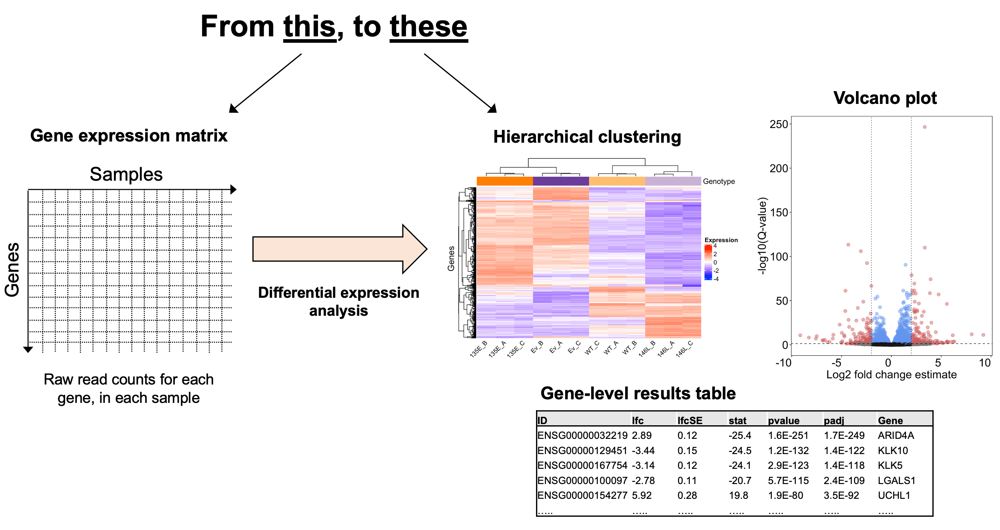

# Day 2 - Differential expression 

### What is a differential expression analysis?
- Statistical testing of individual genes for differential abundances across experimental conditions
- Requires read counts (from alignments) to be normalized between sequencing libraries, and modelled using an appropriate statistical distribution
- Several R-packges exist for differential expression analysis, each leverging different algorithms for steps such as normalization and model fitting. e.g. DESeq2, edgeR, limma-voom
- For the workshop, we will use DESeq2, described in [Love et al, 2014](https://genomebiology.biomedcentral.com/articles/10.1186/s13059-014-0550-8)



### Brief outline of analytical workflow:
- Assemble gene expression matrix from read counts of individual samples
- Filter genes with low or no read counts
- Transform data and perform exploratory analyses (e.g. clustering)
- Normalize for library size and compsition 
- Fit statistical models and test differential expression (adjusting for multiple testing)
- Annotate results & export them 
- Visualize results 

load the packages we are going to need 
```R
library(dplyr)
library(ggplot2)
library(tximport)
library(DESeq2)
library(biomaRt)
library(vsn)
```

Read in sample info (must include variable called 'design')
```R
samples <- read.csv("metadata.csv", stringsAsFactors = FALSE)

# set up the experimental condition as a factor
samples$siRNA <- factor(samples$siRNA, levels = c("WT", "mutant"))

# get htseq-count file names 
sampleFiles <- list.files(pattern = "*htseq-counts")

# order files by sample name 
sampleFiles <- sampleFiles[order(sampleFiles)]

# sample file names must match sample names and order of them in covariate/sample sheet file 
all(sampleFiles == samples$sample)
```

R the read quantification results into R using DESeq2
```R
# set df up containing these
sampleTable <- data.frame(sampleName = samples$sample,
                          fileName = sampleFiles, 
                          design = samples$siRNA)

# read into DEseq2 object 
dds <- DESeqDataSetFromHTSeqCount(sampleTable = sampleTable,
                                  directory = dir2, 
                                  design = ~design)

```

Run the DESeq2 analysis (normalization)
```R
# run the DEseq2 analysis 
dds <- DESeq(dds)

# drop genes with low counts 
keep <- rowSums(counts(dds)) >= 10
dds <- dds[keep,]

# save DESeq object (we can load this in directly in the future)
save(dds, file = "DESeq2.rdata")

```


Now that we've normalized read counts across samples for library size and composition, we are ready to start exploring the data. 

Lets run a principal components analysis to explore how similar/different each sample and sample group is from each other 

```R


```


```R
# first need to transform counts onto log scale, here using DESeq2's regularized logarithm approach 
rld <- rlog(dds, blind = FALSE)

# calculate variance of gene expression across sample 
var <- rev(rowVars(assay(rld))[order(rowVars(assay(rld)))])

# plot variance for genes accross samples
plot(var, las = 1, main="Sample gene expression variance", xlab = "Gene", ylab = "Variance")
abline(v=500, col="red") ; abline(v=500, col="green")
```

500 seems like a reasonable number of variable features (genes) here. Genes without much varaince between samples don't meaningfully contibute toward clustering analysis, as they don't explain any differences between the samples.  

```R
# modify variable feature number to be used in PCA and hierachical clutering based on no. of most variable features 
var_feature_n <- 500

# perform PCA and order by variance 
rv <- rowVars(assay(rld))
select <- order(rv, decreasing = TRUE)[seq_len(min(var_feature_n, length(rv)))]
pca <- prcomp(t(assay(rld)[select, ]))

# extract the percent variance explain by each PC
percentVar <- pca$sdev^2/sum(pca$sdev^2)
names(percentVar)[1:10] <- c("PC1", "PC2", "PC3", "PC4", "PC5", "PC6", "PC7", "PC8", "PC19", "PC10")

# plot variance for top 10 PCs 
barplot(percentVar[1:10], col = "indianred", las = 1, ylab = "Percent Variance explained", cex.lab = 1.2)


# construct data frame w/ PC loadings and add sample labels 
pca_df <- as.data.frame(pca$x)
pca_df$group <- dds$design
pca_df$sample_ids <- colnames(dds)

# add colors for plotting to df 
pca_df$col <- NA
for(i in 1:length(levels(pca_df$group))){
  ind1 <- which(pca_df$group == levels(pca_df$group)[i])
  pca_df$col[ind1] <- i
}

# plot PC1 vs PC2
plot(pca_df[, 1], pca_df[, 2], 
     xlab = paste0("PC1 (", (round(percentVar[1], digits=3)*100), "% variance)"), 
     ylab = paste0("PC2 (", (round(percentVar[2], digits=3)*100), "% variance)"),
     main=("PC1 vs PC2 for ", var_feature_n, " most variable genes"),
     pch=16, cex=1.35, cex.lab=1.3, cex.axis = 1.15, las=1, 
     panel.first = grid(),
     col=pca_df$col)
text((pca_df[, 2])~(pca_df[, 1]), labels = pca_df$sample_ids, cex=0.6, font=2, pos=4)
```


In addition to sample similarity, we can use PCA to identify potential batch effects. A batch effect may cause samples to cluster by batch, rather than experimental condition, in a PCA plot. 

There are several ways to handle batch effects, including directlty adjusting for batch in the statistical model. Choices of how to handle a batch effect, including whether to throw out samples, are complex and unfortuantely beyond the time constraints of this workshop. 


### Unsupervised hierachical clustering 

How do the differences between samples for the most variable features look at the indvidual gene level? We can plot a heatmap to explore this. 


```R
# select rlog normalized count values for top X no. of variable genes 
topVarGenes <- head(order(rowVars(assay(rld)), decreasing=TRUE), var_feature_n)

# set up gene expression matrix 
mat1 <- assay(rld)[topVarGenes,]

# scale matrix 
mat_scaled = t(apply(mat1, 1, scale))

# set up colors for heatmap 
col = colorRamp2(c(-3, 0, 3), c("blue", "white", "red"))
cols1 <- brewer.pal(12, "Paired")

# set up variable w/ levels for sample group to be used in annotation bar 
genos <- as.character(dds$design)
genos <- factor(genos, levels = c("WT", "mutant"))
ha1 = HeatmapAnnotation(Genotype = genos, 
                        col = list(Genotype = c("WT" = cols1[1], "mutant" = cols1[2]), 
                          show_legend = TRUE)

# set up column annotation labels (samples) for bottom annotation of individual samples 
ha = columnAnnotation(x = anno_text(colnames(dds), 
                                    which="column", rot = 45, 
                                    gp = gpar(fontsize = 10)))

# generate heatmap object 
ht1 = Heatmap(mat_scaled,name = "Expression", col = col, 
              bottom_annotation = c(ha),
              top_annotation = c(ha1),
              show_row_names = FALSE)

# plot the heatmap & write to file 
png(paste0(dir3, "heatmap_top_", var_feature_n, "_genes.png"), width=7.5*ppi, height=5*ppi, res=ppi)
draw(ht1, row_title = "Genes", column_title = "Hierachical clustering, ", var_feature_n, " most variable genes")
dev.off()

```

What are the values being plotted here? How should they be interpreted? 

### Differential expression analysis 

Now we can run the differential expression analysis: 
```R
# get results for DEG analysis (and order by Pval) by specifying design 
res <- results(dds, alpha = 0.05, 
  contrast = c("design", paste0(g1), paste0(g2)), 
  lfcThreshold = 0, 
  altHypothesis = "greaterAbs")

# remove results w/ NA for adjusted Pval
res <- res[!is.na(res$padj),]

# order by adj Pval 
res_ord <- res[order(res$pvalue),] 

# quick check for how many DEGs with significance @ 5% level in either FC direction 
sum(res$padj < 0.05 & res$log2FoldChange>2, na.rm=TRUE)
sum(res$padj < 0.05 & res$log2FoldChange<-2, na.rm=TRUE)
```


### Why adjust for multiple testing 

First, what is a P-value:
The probability that you would observe a result as more more extreme as the one you observed, simply by chance. 

In RNA-seq, we are asking, what is the probability I would observe a fold-change value as, or more extreme, as observed for gene X, simply by chance. 

If we use a nominal significance threshold of 5% (P<0.05), then 5% of all fold-change values calculated in differential expression testing will be false positives. If we test 20,000 genes, How many false positives would we get at this threshold? 


Run a multiple testing example
```R
# draw random values from a normal distribution 
rnorm(0, 1, 1)
# run t.test comparing the means of the distibution

# plot the results 
plot(-log10(res$pvalue), main = "-log10 P-value for 10,000 t.tests")

# add a line for Bonferonni significance threshold 
abline(h= -log10(0.05))
```

How many tests have a P-value < 0.05?
```R
sum(res$pvalue < 0.05)
```

Clearly, there are many false-positives here..

How many tests have a Bonferonni adjusted P-value < 0.05?
```R
sum(res$pvalue < (0.05/nrow(res)))
```

Multiple testing is critical in RNA-seq data analysis. The method you use to adjust for multiple testing and the threshold you choose are dictated by the nature of your experiment and the confidence you require. 

e.g. if your performing a hypothesis generating experiment, a more relaxed threshold is acceptable. If you are trying to identify idnividual genes that may serve as effective biomarkers for patient stratification, you may want to be more conservative. 


### Volcano plots

Useful visualiztion to explore the statistical significance & effect size (fold-change) of our results. 

Here's an example: 


Lets generate one for our results:
```R


```

### Mean-average (MA) plots

Also useful for RNA-seq, as they allow you to identify genes with the largest fold-changes across your experimental conditions AND are expressed at the highest levels. 

Lets generate one for our results:
```R


```


### Heatmap of differentially expressed genes 

We can also generate a heatmap to demonstrate the extent of statistically significant results between our experimental conditions. This is different, although analogous to, using the most variable gene between samples to generate our heatmap. 

```R


```


### What can we do with differential expression results: 
- Gene ontology (GO)/pathway analyses 
- Integrate with other genomics data (intregrative genomics), e.g. ChIP-seq, ATAC-seq, proteomics 


### Additional notes: 
- There are many package-specific functions and tools you can use to explore your results. These are one example, you may prefer another. 
- There are other 'diagnostic plots' that should be generated in an RNA-seq analysis, to confirm the analysis is robust. These depend on the tool used and you should consult the tools documentation to figure out which plots you should generate for your dataset. 
- Differential transcript utilization analyses require a different analytical framework (e.g. DEXseq)


## Exercises
1. Your PI is upset that their favourite gene was not found to be differentially expressed. They demand to know why. Generate a simple plot using the count data to help demonstrate that it was not expressed between the conditions. 

2. You run differential exprression analysis on your exteremly well-powered dataset (6 replicates per conditions, with replicates showing good excellent concordance within experimental condition in the PCA plot), but 4000 genes are differentially expressed at the significance threshold you chose. What do you do? Can modifying the lfcthreshold argument in DESEq2's *results()* function help here? 


