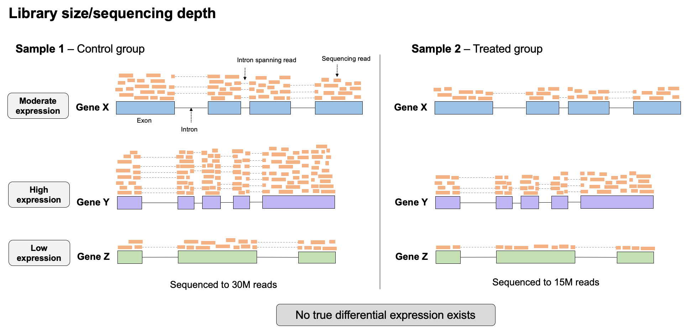
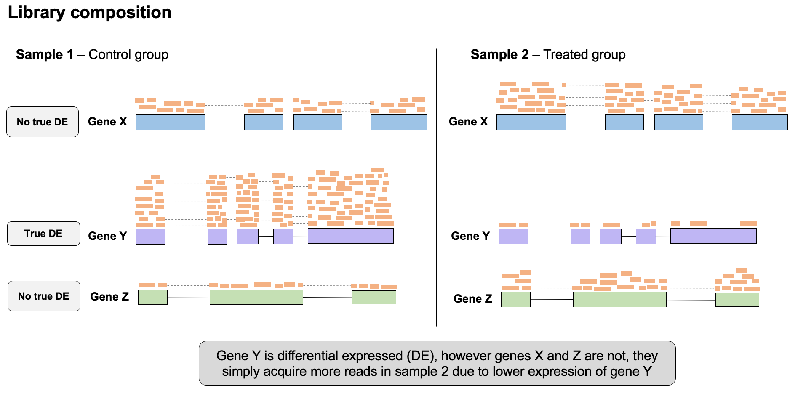
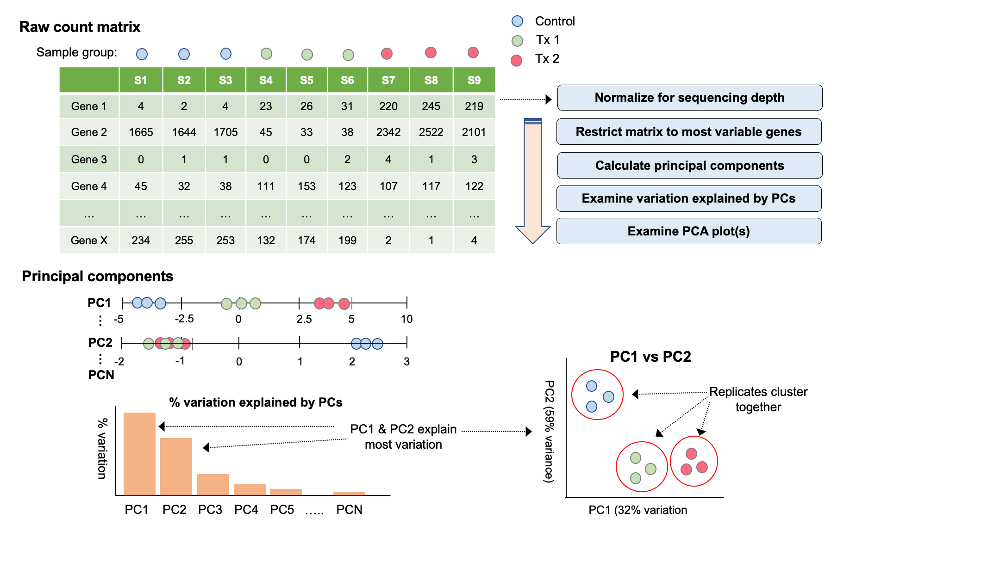
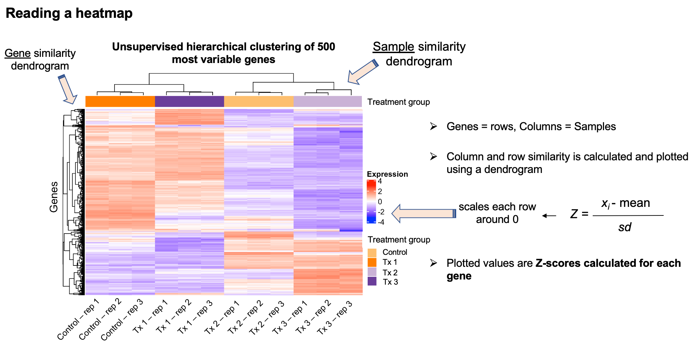
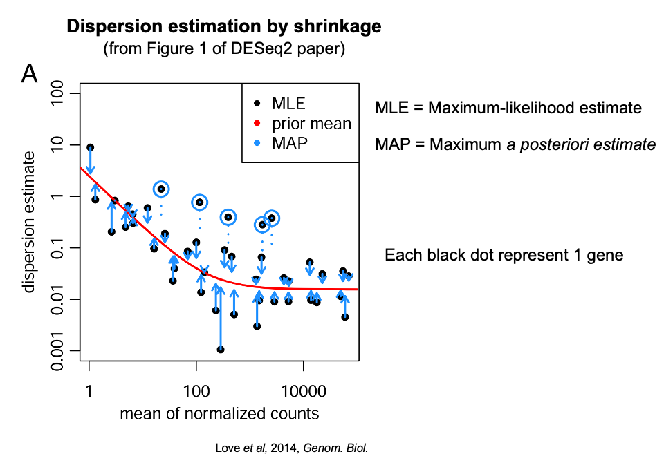
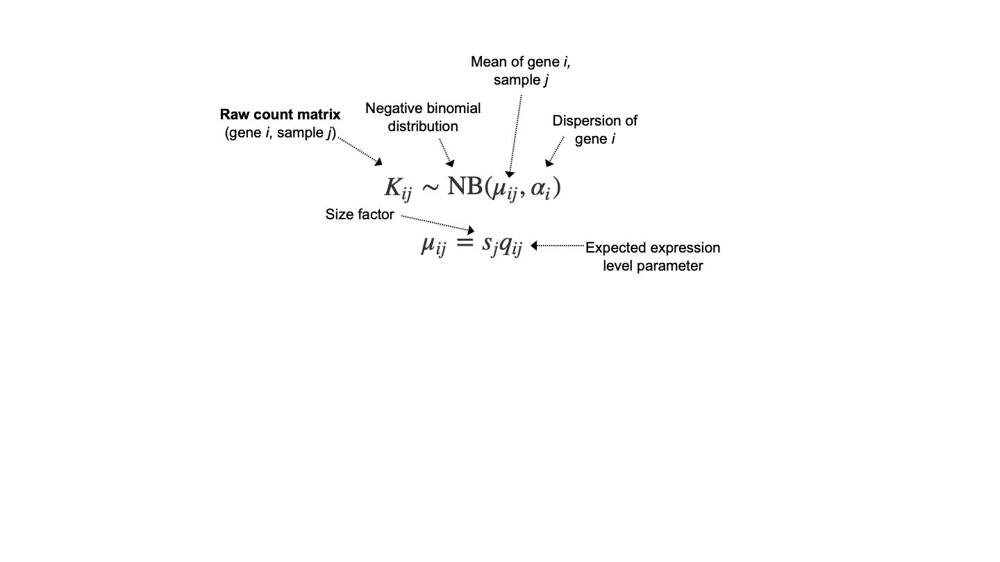

# Differential gene expression in R using DESeq2

Several popular R packges designed for exploration and statistical analysis of bulk RNA-seq data exist, including [*EdgeR*](https://www.bioconductor.org/packages/release/bioc/html/edgeR.html), [*limma-voom*](http://bioconductor.org/packages/release/bioc/html/limma.html), [*DESeq2*](https://bioconductor.org/packages/release/bioc/html/DESeq2.html). For the purposes of this outline, we will use DESeq2 to perform the parts of the analysis, including reading in the data, normalization of read counts, and fitting statistical models to test differential expression. [Detailed tutorials](https://bioconductor.org/packages/release/bioc/vignettes/DESeq2/inst/doc/DESeq2.html) for using DESeq2 can be found on its Bioconductor page. 

DESeq2 is a very well organized package that applies robust algorithms to perform several aspects of RNA-seq data analysis. If you plan to use DESeq2 for your work, you should read both the tutorials made available on their Bioconductor page, and the original manuscript for DESeq2, in [Love *et al*, 2014](https://genomebiology.biomedcentral.com/articles/10.1186/s13059-014-0550-8) to develop an understanding of the theory behind DESeq2 and the proccesses implemented by its functions. 

Despite DESeq2's extensive functionality, a different package may be appropriate for the analysis of RNA-seq data with unique experimental designs, for example using linear-mixed effects models to perform differential expression analysis of clustered datasets. 

### Read in raw count data 

How you read your data into DESeq2 depends on what format your raw reads counts are in (individual files for each sample, or a gene expression matrix) and how your read counts were quantified (e.g. at the gene or transcript level). `DESeq2` provides a specific function `DESeqDataSetFromHTSeqCount` to read in gene-level read count abundances from *htseq-count*. 
If you estimated **transcript-level counts** (rather than **gene-level counts** produced by htseq-count) using a method like *RSEM*, *Salmon*, or *kallisto*, using the tximport() function from the [tximport package](https://f1000research.com/articles/4-1521/v1). You may have estimated transcript-level counts if you used a library-preparation protocol that captures full length transcript information. 

### Read in sample metadata

We also need to read in the sample annotation (metadata), which contains sample labels, experimental labels, and sequencing run information, etc. 

___________
### Construct the *DESeq2* data set & explore the characteristics of the data 

*DESeq2* uses an object class called the `DESeqDataSet` that stores the read counts, metadata, experimental design, and all the intermediate values calculated during the analysis. `DESeqDataSet` extends the `SummarizedExperiment` class object from the `SummarizedExperiment` R/Bioconductor package that is commonly used to store data from expression studies and other genomics assays in R. 

Three elements are required to generate the `DESeqDataSet`:  
- matrix of raw counts  
- sample metadata (colData)  
- a design formula   

___________
### Normalization of raw counts 

Before comparing expression levels of specific genes between samples, and performing any differential expression analyses, it is important that we normalize the data to account for variation in expression that is not related to true differential expression. There are two major sources variation that we need to adjust for in the normalization process for RNA-seq data when we wish to compare expression levels **between** samples:  

#### Library size/sequencing depth  

Although we generally try to pool samples together (each sample is tagged with a barcode and samples are combined) at similar concentrations in a sequencing run, some samples will end up being sequenced more than others, leading to slight differences in how many reads are produced for that sample, and therefore sequencing depth and size. Furthermore, if samples are sequenced on separate runs, their sequencing depths may be very different. If we don't account for this variation in sequencing depth, we might conclude some genes are expressed at greater levels in a sample that has simply been sequenced to a higher depth.  

#### Library composition 

The presence of truly differentially expressed genes (in particular, DEGs with very large fold changes) between samples will cause the number of reads for other genes in those samples to be skewed. For example, in the below example, gene C is differentially expressed between the two samples, with much higher expression in sample 1. This high number of reads causes fewer reads to be detected for other genes in this sample, making it appear that these other genes are expressed at lower levels than in sample 2, however this is simply an artifact of library composition differences between the samples. 

To correct for **library size** AND **library composition**, DESeq2 uses a algorithm referred to as the **median-of-ratios** method. This procedure will generate a matrix of read counts that are corrected for both **library size** and **library composition**, and are stored in our (`DESeqDataset`) object. DESeq2 uses the function (`estimateSizeFactors()`) to perform this algorithm and calculate size factors for each sample. Lets do this for our (`DESeqDataset`). 
**Important note:** the normalized count matrix is normalized for **library size and composition**, which means we can compare expression levels of individual genes across samples. The read counts are NOT normalized for gene length, so we cannot use this matrix to compare expression levels between genes within the same sample. This is important because some genes may simply pick up more reads than others because they are larger, making them appear more highly expressed than a smaller gene, which may not be the case. 

For such comparisons between genes, we need to use measures such as:  
- *Transcripts per million (TPM)*  
- *Fragments per kilobase million (FPKM)*  
- *Reads per kilobase million (RPKM)*  

__________
### Exploratory data analysis & quality control

Before we run the differential expression analysis, we should explore our dataset to learn a little more about it. Importantly, we should determine how samples are related to each other based on their gene expression profiles, ensure replicates cluster together, assess the potential for any batch effects (technical variation between samples run on different machines or by different technicians) that may exist, and more generally build expectations for the DE analysis. 

For these exploratory analyses, we use several unsupervised methods to assess how our samples cluster relative to one another. These unsupervised approached include **principal components analysis (PCA)**, and **unsupervised Hierarchical clustering** and are commonly referred to as *data reduction* appraoches. 

To perform exploratory analyses, it is better to work with a transformed version of the counts, rather than the original untransformed values. DESeq2 actually utilizes its own transformation procedure, called the **regularized logatrithm (rlog)** implemented in the `rlog()` function. The rlog is similar in principle to a standard log transformation of the data, but is able to more appropriately transform the counts for genes with low expression values. 

DESeq2 is also capable of implementing a **variance stabilising transformation (VST)** for count data, this is generally recommended for larger datasets due to increased speed. 

#### Principal components analysis (PCA)

PCA is a mathematical procedure that calculates vectors that explain varition in the dataset (in this case, variation in gene expression), and orders samples along these vectors. We would expect samples that are more similar to each other, e.g. replicates, to be very close to each other along these axes of varaition, while we might expect samples in different treatment groups to be further away. 

Each vector that is calculated is called a principal component (PC), and each principal component explains less varaition in our dataset than the last. e.g, PC1 explains more variation in gene expression differences between the samples than PC2. If we plot PC1 against PC2, samples will 'cluster' with other samples that have similar gene expression profiles, and be further away from samples with more distant expression profiles. 

#### Hierarchical clustering

Hierarchical clustering is another complimentary approach to explore the relationships between your samples. While supervised clustering approaches exist, we will perform an unsupervised analysis so that we do not impose any restrictions on the clustering of the samples. 

Hierachical clustering is often associated with **heatmaps**, as it is a useful way to explore the results of hierachical clustering. Here we represent genes are rows, and individual samples as columns. The  **denrograms ** on the rows and the columns represent the *'distances'* calculated between each of the genes/samples. Presenting the data in this way is useful as it allows us to identify samples whose patterns of gene expression are similar to each other, but also modules of genes that change in a similar way across our samples, and may share some common function of interest. 

The first step in a hierachical clustering analaysis is to *scale your data*. This means that expression levels are all transformed onto the same scale before clustering. This is important to do as we can only visualize so many colors at once, and a very highly expressed gene would mean that all the other genes would essentially invisible on this scale. Scaling for clustering in this way is typically performed by calculating Z-scores, where the mean for each gene across all the samples is subtracted from each of the individual expression values for each gene, this centers the expression values around 0. We then divide these values by the standard deviation to make sure the data is more tightly grouped, and we can represent lots of genes in the same scale. 

_____________
### Apply the DESeq2 procedure to the data 

Now we apply the `DEseq()` function to the dataset to perform the analysis. This function is the main powerhouse of the DESeq2 package and does **a lot** under the hood. It is important you understand the general principles of this analysis of before running your own analysis. 

**At a high level, the major function performed by `DESeq2` are:**  
- Estimation of size factors (`estimateSizeFactors()`)  
- Estimation of dispersion (`estimateDispersions`)  
- Fitting of the negative binomial generalized linear model (GLM) and wald statistics for differential expression testing (`nbinomWaldTest`)  

In order to accurately model differential expression for the genes in our dataset, `DESeq2` uses this equation to obtain estimates for the dispersion of each gene within each sample group. 

**However,** for the small number of replicates avaiable in RNA-seq data, these estimates of dispersion at the gene-level are often inaccurate (yet another reason to use more replicates..). 

To improve these gene-level estimates of dispersion, `DESeq2` uses another statistical model called **empirical bayes** to *'shrink'* these inital dispersion estimates toward a *'prior'* mean, which is calculated by fitting a curve to the inital dispersion estimates. 

This procedure produces **more accuarate estimates of disperion** as it shares information across genes with similar expression levels to predict a more approriate dispersion for those genes. This is rational as the formula linking the mean, variance, and dispersion tells us that the variance is the only thing affecting the magnitude of the dispersion for genes with the similar mean expression. 

**The major factors affecting how much a gene's dispersion is shrunk toward the prior mean are:**  
1. the number of samples in the group under consideration (use more replicates!)  
2. how far the inital dispersion is from the prior mean

This Figure taken frm the `DESeq2` paper demonstrates the process of *shrinkage*, where the inital dispersion esimates for each gene (estimated by maximum-likelihood) are shrunken towards the *prior mean* (based on the fitted curve in red) to a final MAP estimate. For dispersion estimates further away from the line, you can see that their estimates are shrunken more than those are are originally closer to the line. 
**It is important to confirm your dispersion estimates are well calibrated before performing your differential expression analysis, as accurate estimation of dispersion is critical in controlling the false-positive rate in experiments with smaller sample sizes (most RNA-seq experiments)**. 

____________
### Differential expression analysis - Hypothesis testing

We fit the data using a **generalized linear model (GLM)**. GLM's are a family of statistical models that generalize standard linear regression in two ways:  
- use of probability distributions other than the normal distribution 
- the use of a *link-function* that links the expression values in the linear model to the experimental groups, in a way that these other distributions (such as the NB) can be used. 

Since we need to model our counts using the negative-binomial distribution, the GLM we will fit is of the NB family of GLMs. 

**The DESeq2 model:**

In order to fit the GLM, we need the **mean count of each gene** across the samples in each experimental group, and the **dispersion of that gene** in those groups. The mean count is a combination of the expected expression level and the size factor, so that our model is corrected for **library size and composition**. 

The process of fitting the model to the expression and dispersion values for each gene results in final set of **model coefficients** for each sample group, which can be interpreted as the **log2 fold-change** in expression for that gene between the baseline group and each comparison group. 

Each of the model coefficients has an associated **standard error** associated with it, which we can use to calculate a **P-value** and perform a process called **hypothesis testing**. Through hypothesis testing we test the *null hypothesis* that the log2 fold-change between experimental groups for an individual gene is not significnatly different from 0 (no change in expression). 

**The default test used by `DESeq2` for hypothesis testing is the *Wald-test*, which is implemented as follows: **  
1. The *coefficient (log 2 fold-change)* is divided by the *standard error* (measure of statistical accuracy of the measurement).  
2. The resulting *Z-statistic* is compared to a standard normal distribution (mean = 0, sd = 1) in order to compute a P-value.  
3. If the P-value is less than our pre-determined threshold for significance, we reject the null hypothesis and accept the alternative, that the gene is significantly DE.  

**Note:** `DESeq2` can also implement a *likelihood ratio test* (LRT), which is used to compare expression accross more than two groups. For example, if you collected samples over a range of time points and you wanted to test if gene expression changed significantly over these time points, you could use the LRT instead of the wald-test. 

#### Why must we correct for multiple hypothesis testing? 

P-values are defined as the probability that we would observe a result as extreme as the one we observed, simply due to chance. In the case of RNA-seq, we are testing the probability that we would observe the log2 FC that we do for a given gene, if this result is due to chance. Therefore if we use 0.05 as a P-value threshold, and we test 20,000 genes for DE, this means that 5% of those genes we tested will have a log 2 FC that has a P-value < 0.05 simply due to chance. 5% of 20,000 is 1000 genes, which is obviously an unacceptable amount of false-positives. 

We address this problem through multiple testing correction. While several methods that control different aspects of the multiple testing problem, we commonly use methods that control the false-discovery rate (FDR) in RNA-seq DE experiments. Controlling the false discovery rate at 10% means that we are accepting that 1 in 10 of the genes with a significant adjusted P-value, is actually a false-positive, and not truly differentially expressed. RNA-seq DE studies are usually hypothesis generating in nature, so this is usually an acceptable compromise, however if your experiment requires more stringency, you may wish to use a method that controls the family-wise error rate (FWER), such as **Bonferonni** correction. 
____________
### Visualization of Differential Expression 

#### Volcano plot

Volcano plots are a useful visualization for exploring your results, the **log2 fold change** (x-axis) is plotted against the **-log10 P-value**. Since the -log10() of a really small number is a very large value, any gene that has a very small P-value and was significantly differentially expressed, will appear higher up along the y-axis. In contrast, the -log10 of 1 (`-log10(1)`) is equal to `0`, therefore genes with low statistical significance (P-values approaching 1) will appear lower down on the y-axis. 

Similarly, genes with larger fold changes will appear further along the x-axis, in both directions. Genes with a positive fold change represent genes whose expression was greater than the group of the experimental design variable used as baseline, while genes with a negative fold change represent genes whose expression was lower than in the baseline group.

The fold-change value of genes with non-significant fold changes is not meaningful, as there is not enough statistical confidence in these fold changes. 

#### MA plots

MA plots are also useful ways to visualize results from a DE analysis of RNA-seq data. These involve plotting the log2 fold-change (the so called M-value, representing the *M* in *MA-plot*) against the average expression level of a gene (the *A* in *MA-plot*). 

The MA-plot allows us to inspect the **full range of expression values over which we detected significant DEGs, and what the magnitude of these fold-changes is**. In a typical experiment, we expect to see DEGs across most of the range of expression values. To help identify genes that were significantly DE, any gene with an adjusted P-value of < 0.05 (or whatever threshold is set) is colored in red. 

**To obtain more useful LFC estimates,** `DESeq2` performs a statsitical procedure that involves **shrinking the raw fold change estimates toward zero** for genes that are less likely to contain reliable or highly important information. 

This is done in a very similar way to the shrinkage using empirical bayes that we discussed for the **dispersion estimates**. 

**For shrinking LFC values, LFCs are penalized for properties such as: **  
- low count values   
- high dispersion (& thus reduced confidence in expression levels)  

DESeq2 provides a function `lfcShrink()` that must be implemented separately of the standard workflow implemented using `DESeq2()`. 

#### Hierachical clustering on the DEGs

A final visualization that is useful to generate is a heatmap based on unsupervised hierachical clustering of the DEGs identified. We do this by limiting the matrix of rlog values to only those for the DEGs, and then performing the clustering specifically on these data. 

