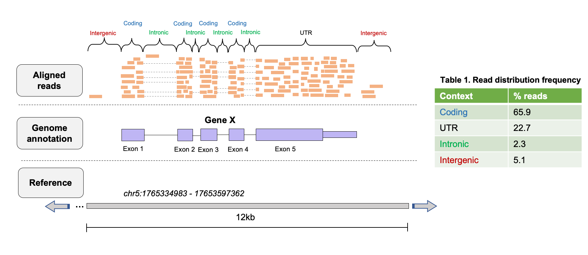
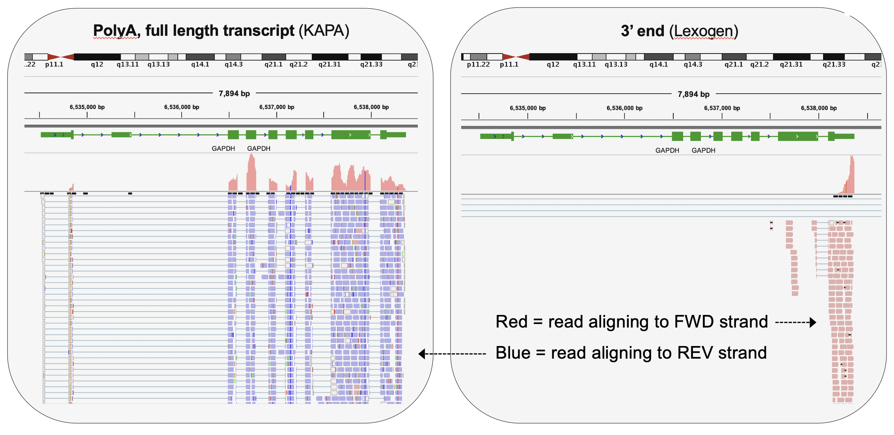

## Quality control of FASTQ files 

An excellent tool that is specifically designed assess quality of FASTQ file is [FastQC](https://www.bioinformatics.babraham.ac.uk/projects/fastqc/). FastQC is composed of a number of analysis modules that calculate various QC metrics from FASTQ files (such as GC content, distribution of base quality, etc.) and summarizes this all into a nice QC report in HTML format, that can be opened in a web browser. 
**Note**: FastQC does not use the entire dataset, just the first few thousand reads in the FASTQ file, therefore there could be some bias introduced by this, although we assume there isn't since entires are placed into FASTQ files randomly. 
Opening and evaluating an individual .html file for each FASTQ file is obviously going to be tedious and slow. [MultiQC](https://multiqc.info/) *MultiQC* searches a specified directory (and subdirectories) for log files and synthesizes these files into a single browsable, sharable, interactive .html report that can be opened in a web-browser. *MultiQC* recognizes files from a very wide range of bioinformatics tools (includeing FastQC), and allows us to compare QC metrics generated by various tools across samples and analyze our experiment as a whole. 

_____________
## Read pre-processing & trimming

An additional QC step we can perform before proceeding with the read alignments is to *pre-process* or *trim* the sequences in the FASTQ files to remove sequences that we are not interested in, or were not called confidently by the sequenecer. This step is **optional** in most analysis, although should be based on an empirical decision that leverages the QC assessment of raw FASTQs. For example, if we see we have a large number of adapter seqeunces in our data, or a high proportion of low-quality bases near our read ends, we may wish to trim our raw reads. In the absence of such issues, we could skip this step. 
One reason this step is optional is that many aligners can account for mismatches or low quality bases at the end of reads during the alignment process. The aligner will *soft-clip* these bases from the alignment when it maps that read (more on this later) so we do not necessarily need to have these bases trimmed off all of the reads. 

Several algorithms exist for trimming reads in FASTQ format. Generally, these algorithms work by looking for matches to the sequence you specify at the 5' and 3' end of a read. You can specify the minimum number of bases you would like to be considered a match, as the algorithm will trim partial matches to the sequence you specify. Examples of sequences you might want to remove include: adapter sequences, polyA tails, or low quality bases. 
[Cutadapt](https://cutadapt.readthedocs.io/en/stable/) is a useful tool for cleaning up sequencing reads, and allows for multiple adapters to be specified simulatenously, and has numerous options that can be tweaked to control its behaviour. 

__________________
## Principles of read alignment for RNA-seq
The goal of aliginging reads to a reference genome is to find the ***most likely location in that reference genome where the read originated from***. In the context of RNA-seq, this means we try to find the most likely gene in the reference genome that transcribed the RNA fragment which ultimately ended up in our cDNA library. Doing this for millions of reads allows us to quantify how many RNA fragments were transcribed from a given gene, so we are using the read alignment to measure gene expression. 
Although we won't go into the theory here, aligning reads to reference genomes involves ***mapping*** to identify the most likely position of the read in the reference genome, followed by the ***alignment***, which describes the base-by-base relationship between the read and the reference. Alignments are often imperfect, and are associated with quality scores (***MAPQ scores***) that describe the quality of the alignment. 

**Challenges of aligining millions of short reads to a refence genome involve:**
- Mismatches introduced by **genetic variation** and **sequencing errors**
- **Repeitive sequences** in genomes (e.g. start and end of chromosomes)
- Presence of **intron** in reference genomes, meaning aligners must be able to consider **splice-junctions**

It is important when selecting an aligner to use for your dataset that it is appropriate for your experiment, as numerous aligners exist and make different assumptions and have different strengths/weaknesses. Importantly, some aligners are ***splice-aware*** while others are not. ***Splice-aware*** aligners can generate alignments to a reference genome that span the intronic regions and therefore account for splicing, e.g. `STAR` and `HISAT2`. If your dataset is prokaryotic (non-splicosomal) you would **not** want to use a splice-aware aligner, and instead using an aligner that is not designed to map across intronic regions such as `bwa-mem` or `bowtie2`. 
It is also worth noting here that generating alignments is the most time consuming step of the analytical pipeline for most NGS analyses, and for RNA-seq, the field is moving toward quantification of gene expression using novel *'lightweight'* alignment tools, that are **extremely fast**, e.g. [Kallisto](https://pachterlab.github.io/kallisto/about), [Salfish](https://www.nature.com/articles/nbt.2862), and [Salmon](https://combine-lab.github.io/salmon/). These algorithms avoid generation of typical base-by-base alignments, and instead generate ***psuedo-alignments***, which have been shown to produce very accurate estimates of transcript abundances in RNA-seq data. 

  

### Concepts for read alignment 

**Read clipping**  
Aligners are capable of 'clipping' reads from sequence ends if they do not improve the quality of an alignment that exists for the rest of the sequence.  

There are two type of clipping:  
- *Soft-clipping*: bases at 5' and 3' ends of the read will be kept in the read sequence in the BAM file, but are NOT part of the alignment
- *Hard-clipping*: bases at 5' and 3' ends of the read will be removed from the BAM file altogether and are NOT part of the alignment 

Such clipping is commonly used by aligners to get rid of sequence contamination, e.g. ***adapter sequences*** or ***polyA tails*** from mRNAs, so that it does not affect the alignment. At least for RNA-seq, this is why you do not necessairily need to be very aggressive in read trimming and pre-processing steps. 

Clipping can be very advantageous, but also can potentially cause some issues, read more [here](https://sequencing.qcfail.com/articles/soft-clipping-of-reads-may-add-potentially-unwanted-alignments-to-repetitive-regions/). 

**Splicing**  
As discussed above, numerous aligners exist, consisting of both ***splie-aware*** and ***splice-unaware*** aligners. Splice-aware aligners, such as `STAR` and `HISAT2` will produce alignments spanning splice junctions, which is obviously an important characteristic of RNA-seq data that the aligner needs to be able to account for. Furthermore, if you provide coordinates of splice-junctions to aligners like `STAR`, it can improve the mapping over spliced regions and improve detection of novel splice-functions. 

**Genome vs transcriptome mapping?**  
While there are times when one may want to map to a transcriptome, there are issues with this approach.  
- If your annotated transcriptome is not complete, you may fail to map some reads simply because the sequences aren't in your reference, which would not be an issue if you mapped to the genome. 
- With multiple splice isoforms it is difficult to disambiguate which splice isoform a read should be aligned to in transcriptome mapping. 
- You cannot identify novel transcripts this way.

### STAR (Spliced Transcripts Alignment to a Reference)
STAR is a very flexible, efficient, and quick read aligner. It uses a method of seed searching, clustering, stitching, and scoring to find the most probable match in the reference sequence for each read. A seed is the longest possible match between a read and the reference sequence. By using multiple seeds on a single read, reads are able to span hundreds of base pairs across splice junctions. Once a read is mapped into multiple seeds STAR attempts to map the remaining unmapped portions of the read by extending the seed match allowing for indels and mismatches. Any portion of the read that cannot be mapped is assumed to be contamination, leftover adapter sequences, or an incorrect base call and these bases are clipped (soft-clipping). I encourage you to go look through the [user manual](https://github.com/alexdobin/STAR/blob/master/doc/STARmanual.pdf) if you plan to use STAR. 
Before running an alignment with STAR, you need to create an index of your reference genome, and specify the location of this index when you run the aligner. The index is in principle similar to how one might index a book, so that specific items or information can be found more quickly. For the genome index, we are indexing the genome so that the aligner can narrow down where a read may map to and speed up mapping. 

________________
## Principles of post-alignment QC
Once you have aligned your reads, it is important to assess how well our reads could be mapped to the reference genome. The primary metric of a successful alignment is the **percentage of uniquely mapped reads**, and while this depends on the organism and reference genome you map to, a good quality sample is expected to have ~75% of its reads uniquely mapped. Other useful alignment metrics include:
- **Proportion of ribosomal RNA (rRNA) reads**: rRNA constituties the large majority of RNA present in most cell types, which are usually not of interest in our experiment, therefore we try to reduce their numbers using depletion and polyA slection procedures in library preparation. These procedures are not always 100% effective. If the proportion of rRNA reads is high, you should filter these reads before differential expression analysis, as it may skew the normalization of your count matrix. 

- **Genomic context of reads**: We expect the majority of our reads to map in coding/UTR regions, with few reads in intronic or intergenic regions. If the proportion of intronic or intergenic reads is high, this could suggest your library is contaminated with genomic DNA, or the annotation provided for the reference genome is incomplete. 

***Fig. 1.** Genomic context of aligned reads can fall into several categories dictated by the annotation used. *

- **Gene body coverage**: Depending on the type of library protocol used, you will have an expectation for the average distribution of reads over gene bodies. For full-length transcript methods, you expect coverage over the entire body of a gene, however for 3'-end methods (e.g. QuantSeq) you expect a heavy 3' bias. Any significant deviations from expected can indicate sample quality problems that may be reflective of issues in library preparation. 

***Fig. 2.** Comparison of gene-body coverage for KAPA & Lexogen RNA-seq libarries. Image from: Ma *et al*, 2019, *BMC Genomics*.*

- **Strand specificity**: For stranded library-preparation protocols, we expect almost all the reads to come from the expected strand (e.g. *REV* for KAPA libraries, *FWD* for QuantSeq 3' libraries. For non-stranded protocols, the distribution of reads should be equally split between *FWD* and *REV*. 

***Fig. 3.** Strand orientation is dependent on library preparation method.*

-**Duplicate reads**: Library preparation for RNA-seq generally involves ***PCR amplification*** of the input material to generate enough cDNA for sequencing. This PCR amplification can introduce bias into RNA-seq libraries as it is known that **not all fragments are amplified as efficiently as others**. Amplification bias is affected by features such as **GC content** and **fragment length**. Furthermore, on certain Illumina sequencers, an independent type of duplicate can occur, called *optical duplicates*, where large clusters formed on the flowcell during sequencing are called as two separate clusters. 

[**Picard tools**](https://broadinstitute.github.io/picard/) (Star-trek) provides a useful tool, called [*CollectRNASeqMetrics*](https://gatk.broadinstitute.org/hc/en-us/articles/360037057492-CollectRnaSeqMetrics-Picard-) that calculates these metrics, taking the alignment SAM/BAM file as input, and returning a text file with the suffix `.output.RNA_Metrics`. 
[**MarkDuplicates**](https://gatk.broadinstitute.org/hc/en-us/articles/360036834611-MarkDuplicates-Picard-) from *Picard Tools*. *MarkDuplicates* works by comparing the coordinates, orientation, and sequence of read pairs in an input SAM/BAM file. Completion of *MarkDuplicates* will generate a text file with the suffix `xxx.markduplicates_metrics.txt` that documents key duplication statistics that can be included in our QC report. 
[Multiqc](https://multiqc.info/) will read the logs from both of these tools and their output can be incorporated in a quality control report for all samples.

__________
## Quantifying read counts for RNA-seq 
For most downstream analyses in RNA-seq, especially differential expression, we care about how many reads aligned to a specific gene, as this tells us about the genes expression level, which we can then compare to other samples. Inherently, this means that we want to make these data *count-based*, so that we can use statistical models to compare these counts between experimental conditions of interest. 

There are a number of methods that one can use to quantify reads overlapping specific features ( in this case, exons). These methods require a .bam file as input, in addition to a list of the genomic features that we wish to count reads over. The most simplistic methods (e.g. [htseq-count](https://htseq.readthedocs.io/en/release_0.11.1/count.html), [featureCounts](http://subread.sourceforge.net/)) use a specific set of rules to count the number of reads overlapping specific features. These are a good choice if your data is less complex, e.g. 3'-end data. 

Other methods leverage probablistic modeling in order to quantify the alignments (e.g. [RSEM](https://deweylab.github.io/RSEM/)), which ascibes reads to features with a probability of this being the correct location for a given read. Generally, these methods are used on more complex data (e.g. full-length transcript and/or paired-end data) where transcript estimates are of interest. 
